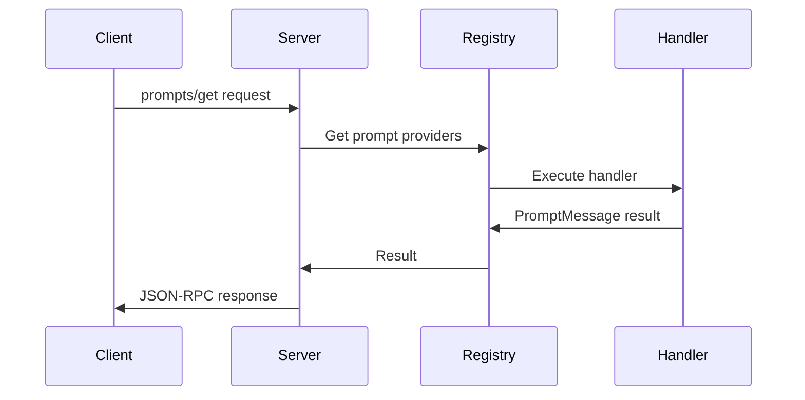

# Architecture Documentation

This document describes the architecture of the Go implementation of the Model Context Protocol (MCP).

## Overview

The implementation follows a modular, provider-based architecture that allows for flexible extension of functionality. The main components are:

1. Protocol Types (`pkg/protocol/types.go`)
2. Server Implementation (`pkg/server/server.go`)
3. Provider Interfaces (`pkg/providers.go`)
4. Registry System
   - Prompts Registry (`pkg/prompts/registry.go`)
   - Resources Registry (`pkg/resources/registry.go`)
   - Tools Registry (`pkg/tools/registry.go`)
5. Error Handling (`pkg/registry.go`)
6. Provider Implementations (`pkg/providers/*/provider.go`)

## Component Details

### Protocol Types

The core protocol types are defined in `pkg/protocol/types.go` and implement the MCP specification. Key types include:

- Message types (Request, Response, Notification)
- Capability types (ServerCapabilities, ClientCapabilities)
- Content types (PromptMessage, ResourceContent, ToolResult)
- Protocol-specific types (InitializeParams, InitializeResult)

### Server Implementation

The server (`pkg/server/server.go`) implements the MCP protocol and handles:

- JSON-RPC message parsing and validation
- Protocol lifecycle management
- Request routing to appropriate providers
- Error handling and response formatting
- Provider registry management

The server uses stdio for communication, following the MCP transport specification:
- Reads JSON-RPC messages from stdin
- Writes responses to stdout
- Logs debug information to stderr

### Provider Interfaces

The provider system (`pkg/providers.go`) defines interfaces for implementing MCP features:

```go
type PromptProvider interface {
    ListPrompts(cursor string) ([]protocol.Prompt, string, error)
    GetPrompt(name string, arguments map[string]string) (*protocol.PromptMessage, error)
}

type ResourceProvider interface {
    ListResources(cursor string) ([]protocol.Resource, string, error)
    ReadResource(uri string) (*protocol.ResourceContent, error)
    ListResourceTemplates() ([]protocol.ResourceTemplate, error)
    SubscribeToResource(uri string) (chan struct{}, func(), error)
}

type ToolProvider interface {
    ListTools(cursor string) ([]protocol.Tool, string, error)
    CallTool(name string, arguments map[string]interface{}) (*protocol.ToolResult, error)
}
```

### Registry System

The registry system is split into three specialized packages, each implementing its corresponding provider interface:

#### Prompts Registry (`pkg/prompts/registry.go`)

```go
type Registry struct {
    mu       sync.RWMutex
    prompts  map[string]protocol.Prompt
    handlers map[string]Handler
}

type Handler func(prompt protocol.Prompt, arguments map[string]string) (*protocol.PromptMessage, error)
```

Features:
- Thread-safe prompt management
- Custom handlers for prompt execution
- Argument validation
- Cursor-based pagination

#### Resources Registry (`pkg/resources/registry.go`)

```go
type Registry struct {
    mu          sync.RWMutex
    resources   map[string]protocol.Resource
    handlers    map[string]Handler
    subscribers map[string][]chan struct{}
}

type Handler func(resource protocol.Resource) (*protocol.ResourceContent, error)
```

Features:
- Thread-safe resource management
- Custom content handlers
- Subscription system for updates
- Cursor-based pagination

#### Tools Registry (`pkg/tools/registry.go`)

```go
type Registry struct {
    mu       sync.RWMutex
    tools    map[string]protocol.Tool
    handlers map[string]Handler
}

type Handler func(tool protocol.Tool, arguments map[string]interface{}) (*protocol.ToolResult, error)
```

Features:
- Thread-safe tool management
- Custom execution handlers
- Cursor-based pagination

### Error Handling

The error system (`pkg/registry.go`) provides standardized error handling:

```go
type Error struct {
    Code    int    `json:"code"`
    Message string `json:"message"`
}

var (
    ErrPromptNotFound   = NewError("prompt not found", -32000)
    ErrResourceNotFound = NewError("resource not found", -32001)
    ErrToolNotFound     = NewError("tool not found", -32002)
    ErrNotImplemented   = NewError("not implemented", -32003)
)
```

Features:
- JSON-RPC compatible error codes
- Standardized error messages
- Error type hierarchy

## Message Flow

1. Client sends JSON-RPC message to server's stdin
2. Server parses and validates the message
3. Server routes request to appropriate handler
4. Handler queries registered providers/registries
5. First provider/registry to successfully handle the request provides the response
6. Server formats and sends response to stdout

Example flow for a prompt request:


## Extension Points

The architecture supports several extension points:

1. **New Providers**: Implement provider interfaces to add new functionality
2. **Registry Extensions**: Add new registries for custom resource types
3. **Custom Handlers**: Implement custom handlers for prompts, resources, or tools
4. **Transport Layer**: Server can be modified to support different transports
5. **Protocol Types**: Core types can be extended for new features

## Best Practices

When extending the implementation:

1. **Provider Implementation**:
   - Use registries for simple cases
   - Implement full providers for complex functionality
   - Return clear errors for unsupported features
   - Use appropriate error codes from the MCP spec

2. **Registry Usage**:
   - Use handlers for custom behavior
   - Implement proper error handling
   - Keep registration simple and direct
   - Ensure thread safety

3. **Error Handling**:
   - Use standard error codes
   - Provide descriptive messages
   - Handle all error cases
   - Maintain protocol compatibility

4. **Message Handling**:
   - Validate all input
   - Use proper JSON-RPC error codes
   - Maintain backward compatibility

## Example Usage

Basic server setup with registries:

```go
func main() {
    // Create server
    srv := server.NewServer()

    // Create registries
    promptRegistry := prompts.NewRegistry()
    resourceRegistry := resources.NewRegistry()
    toolRegistry := tools.NewRegistry()

    // Register a prompt with custom handler
    promptRegistry.RegisterPromptWithHandler(protocol.Prompt{
        Name: "hello",
        Description: "A simple greeting prompt",
        Arguments: []protocol.PromptArgument{
            {
                Name: "name",
                Description: "Name to greet",
                Required: false,
            },
        },
    }, func(prompt protocol.Prompt, args map[string]string) (*protocol.PromptMessage, error) {
        return &protocol.PromptMessage{
            Role: "user",
            Content: protocol.PromptContent{
                Type: "text",
                Text: fmt.Sprintf("Hello, %s!", args["name"]),
            },
        }, nil
    })

    // Register with server
    srv.GetRegistry().RegisterPromptProvider(promptRegistry)
    srv.GetRegistry().RegisterResourceProvider(resourceRegistry)
    srv.GetRegistry().RegisterToolProvider(toolRegistry)

    // Start server
    if err := srv.Start(); err != nil && err != io.EOF {
        log.Fatal().Err(err).Msg("Server error")
    }
}
```

## Future Improvements

Potential areas for enhancement:

1. Registry prioritization
2. Concurrent handler execution
3. Handler lifecycle management
4. Enhanced error handling and recovery
5. Support for more transport types
6. Handler configuration system
7. Handler discovery mechanism
8. Enhanced logging and monitoring
9. Registry persistence and state management
10. Dynamic registry updates and hot-reloading
11. Handler middleware support
12. Registry event system