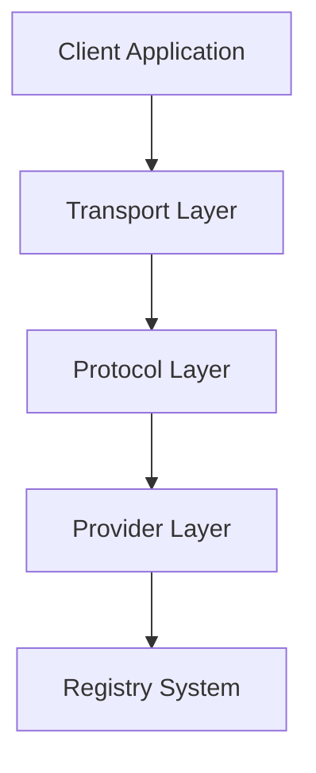
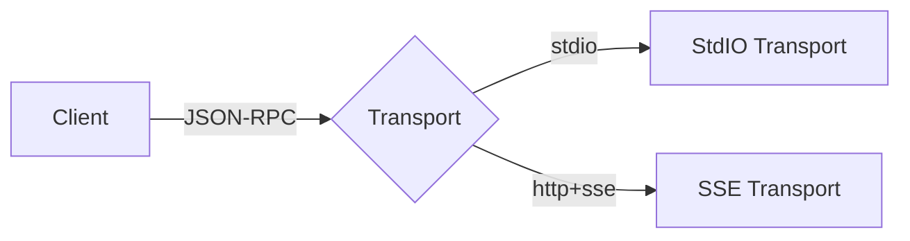
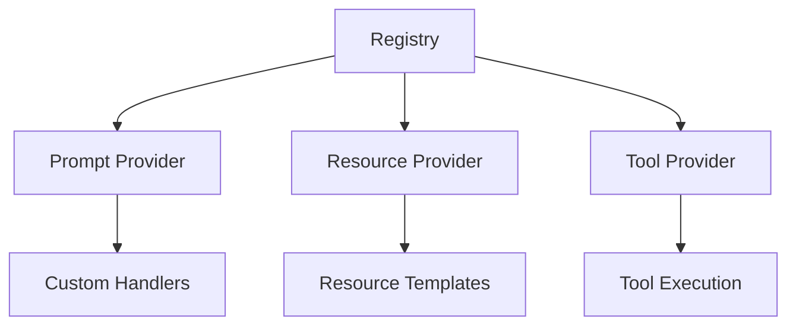

# Architecture Documentation

This document describes the high-level architecture of the Go implementation of the Model Context Protocol (MCP).

## System Overview

The implementation is structured around three core concepts:

1. Protocol Layer
2. Transport Layer
3. Provider Layer



## Protocol Layer

The protocol layer defines the message types and structures used for communication:

```
pkg/protocol/
├── base.go          # Core JSON-RPC types
├── initialization.go # Protocol initialization
├── prompts.go       # Prompt-related types
├── resources.go     # Resource-related types
├── sampling.go      # LLM sampling types
├── tools.go         # Tool-related types
└── utilities.go     # Utility message types
```

Key responsibilities:
- Message type definitions
- Protocol versioning
- Capability definitions
- Error codes and handling

## Transport Layer

The transport layer handles communication between clients and servers:



Features:
- Transport abstraction
- Message serialization
- Connection management
- Error propagation

## Provider Layer

The provider layer enables extensible functionality through interfaces:



Components:
- Provider interfaces
- Registry system
- Handler management
- Resource tracking

## Cross-Cutting Concerns

### Thread Safety

The implementation uses a consistent locking strategy:
- Mutex protection for shared state
- Read/Write locks for registries
- Channel-based synchronization
- Thread-safe transports

### Error Handling

Structured error handling approach:
1. Transport errors
2. Protocol errors
3. Provider errors
4. Application errors

### Logging

Consistent logging strategy using zerolog:
- Structured logging
- Level-based filtering
- Context preservation
- Transport logging

## Implementation Patterns

### Registry Pattern

Used for managing providers:
```go
type Registry struct {
    mu       sync.RWMutex
    providers map[string]interface{}
    handlers  map[string]interface{}
}
```

Benefits:
- Centralized management
- Thread safety
- Dynamic registration
- Handler flexibility

### Transport Pattern

Abstract transport interface:
```go
type Transport interface {
    Start() error  // For servers
    Send() error   // For clients
    Close() error  // For both
}
```

Benefits:
- Pluggable transports
- Protocol independence
- Error isolation
- Resource management

### Provider Pattern

Provider interfaces for functionality:
```go
type Provider interface {
    List() ([]Item, string, error)
    Get(name string) (*Item, error)
}
```

Benefits:
- Extensible design
- Clear boundaries
- Testable units
- Version compatibility

## Directory Structure

```
go-go-mcp/
├── cmd/
│   ├── mcp-server/    # Server executable
│   └── mcp-client/    # Client executable
├── pkg/
│   ├── client/        # Client implementation
│   ├── server/        # Server implementation
│   ├── protocol/      # Protocol definitions
│   ├── prompts/       # Prompt provider
│   ├── resources/     # Resource provider
│   └── tools/         # Tool provider
└── doc/
    ├── architecture.md # This document
    ├── client.md      # Client documentation
    └── server.md      # Server documentation
```

## Further Reading

- [Client Documentation](client.md) - Detailed client implementation
- [Server Documentation](server.md) - Detailed server implementation
- [MCP Specification](../../specification/docs/specification) - Protocol specification