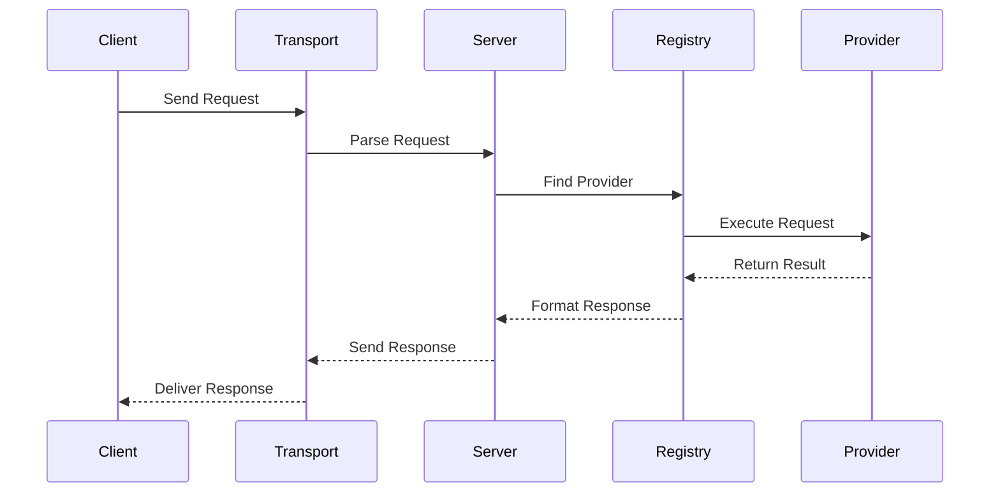

# Server Documentation

This document describes the server implementation of the Model Context Protocol (MCP).

## Overview

The server implementation provides a framework for building MCP-compliant servers with:
- Multiple transport options (stdio, SSE)
- Provider-based extensibility
- Registry management
- Capability negotiation
- Error handling and logging

## Core Components

### Server

The main server type (`pkg/server/server.go`) provides the primary interface:

```go
type Server struct {
    mu       sync.Mutex
    logger   zerolog.Logger
    registry *pkg.ProviderRegistry
}
```

Key methods:
```go
func NewServer(logger zerolog.Logger) *Server
func (s *Server) GetRegistry() *pkg.ProviderRegistry
func (s *Server) StartStdio() error
func (s *Server) StartSSE(port int) error
```

### Transport System

The Transport interface defines server transport behavior:

```go
type Transport interface {
    Start() error
}
```

#### StdioServer

Line-based JSON communication over stdin/stdout:
```go
type StdioServer struct {
    scanner  *bufio.Scanner
    writer   *json.Encoder
    logger   zerolog.Logger
    registry *pkg.ProviderRegistry
}
```

Features:
- Simple request/response
- Line-based protocol
- Blocking operation
- Single client support

#### SSEServer

Server-Sent Events based transport:
```go
type SSEServer struct {
    mu        sync.RWMutex
    logger    zerolog.Logger
    registry  *pkg.ProviderRegistry
    clients   map[string]*SSEClient
    router    *mux.Router
    server    *http.Server
}
```

Features:
- Multiple concurrent clients
- Session management
- Event streaming
- HTTP endpoints

### Provider System

The provider system enables extensible functionality through interfaces:

```go
type PromptProvider interface {
    ListPrompts(cursor string) ([]protocol.Prompt, string, error)
    GetPrompt(name string, args map[string]string) (*protocol.PromptMessage, error)
}

type ResourceProvider interface {
    ListResources(cursor string) ([]protocol.Resource, string, error)
    ReadResource(uri string) (*protocol.ResourceContent, error)
}

type ToolProvider interface {
    ListTools(cursor string) ([]protocol.Tool, string, error)
    CallTool(name string, args map[string]interface{}) (*protocol.ToolResult, error)
}
```

### Registry System

The registry manages providers and their capabilities:

```go
type ProviderRegistry struct {
    mu               sync.RWMutex
    promptProviders  []PromptProvider
    resourceProviders []ResourceProvider
    toolProviders    []ToolProvider
}
```

## Usage Examples

### Basic Server

```go
// Create server
logger := zerolog.New(os.Stderr).With().Timestamp().Logger()
srv := server.NewServer(logger)

// Create and register providers
promptRegistry := prompts.NewRegistry()
resourceRegistry := resources.NewRegistry()
toolRegistry := tools.NewRegistry()

srv.GetRegistry().RegisterPromptProvider(promptRegistry)
srv.GetRegistry().RegisterResourceProvider(resourceRegistry)
srv.GetRegistry().RegisterToolProvider(toolRegistry)

// Start server (stdio or SSE)
if err := srv.StartStdio(); err != nil {
    log.Fatal(err)
}
// or
if err := srv.StartSSE(8000); err != nil {
    log.Fatal(err)
}
```

### Custom Provider

```go
type CustomPromptProvider struct {
    prompts map[string]protocol.Prompt
}

func (p *CustomPromptProvider) ListPrompts(cursor string) ([]protocol.Prompt, string, error) {
    var prompts []protocol.Prompt
    for _, prompt := range p.prompts {
        prompts = append(prompts, prompt)
    }
    return prompts, "", nil
}

func (p *CustomPromptProvider) GetPrompt(name string, args map[string]string) (*protocol.PromptMessage, error) {
    prompt, ok := p.prompts[name]
    if !ok {
        return nil, fmt.Errorf("prompt not found: %s", name)
    }
    // Process prompt with args...
    return &protocol.PromptMessage{
        Role: "assistant",
        Content: protocol.PromptContent{
            Type: "text",
            Text: "Processed prompt content",
        },
    }, nil
}
```

## Message Flow



## Error Handling

The server provides structured error handling:

### Transport Errors
```go
if err := s.writer.Encode(response); err != nil {
    return fmt.Errorf("failed to write response: %w", err)
}
```

### Provider Errors
```go
if err := provider.CallTool(name, args); err != nil {
    return s.sendError(id, -32603, "Internal error", err)
}
```

### Protocol Errors
```go
if request.JSONRPC != "2.0" {
    return s.sendError(id, -32600, "Invalid Request", fmt.Errorf("invalid JSON-RPC version"))
}
```

## Best Practices

1. **Provider Implementation**
   - Keep providers focused
   - Handle all error cases
   - Document behavior
   - Support cancellation

2. **Transport Selection**
   - Match use case needs
   - Consider scalability
   - Handle reconnection
   - Implement timeouts

3. **Error Handling**
   - Use standard codes
   - Provide context
   - Log appropriately
   - Clean up resources

4. **Performance**
   - Use appropriate locks
   - Pool resources
   - Handle concurrency
   - Monitor metrics

5. **Security**
   - Validate all input
   - Sanitize responses
   - Rate limit requests
   - Implement authentication

## Implementation Notes

1. **Message Routing**
   - Method-based dispatch
   - Provider selection
   - Response formatting
   - Error propagation

2. **State Management**
   - Thread-safe operations
   - Client tracking
   - Session handling
   - Resource cleanup

3. **Logging**
   - Request/response logging
   - Error details
   - Performance metrics
   - Debug information

4. **Testing**
   - Provider mocks
   - Transport testing
   - Error scenarios
   - Concurrency testing