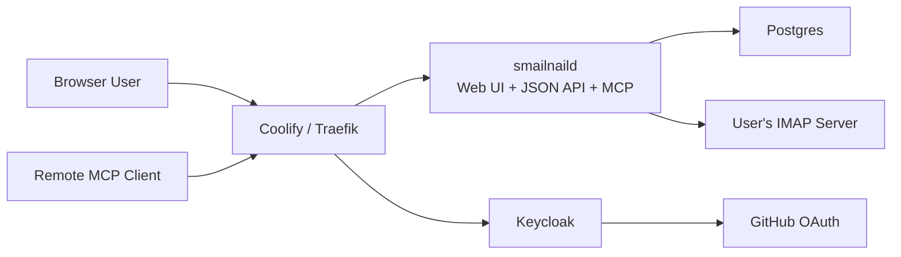

# Coolify deployment, GitHub SSO, per-user IMAP settings, and MCP OIDC architecture guide

## Executive Summary

`smailnail` is not yet a deployable multi-user application. It is currently a set of three Go CLIs that connect directly to IMAP, process YAML rules, and generate email content. There is no HTTP server, no browser login flow, no persistence layer, no user model, and no MCP server in the `smailnail` repo today. That means “deploy this to Coolify with GitHub SSO and per-user IMAP settings” is not a packaging task. It is a product architecture task.

The recommended production design is to add a new hosted Go service, tentatively `smailnaild`, that serves:

- a small browser UI for login and settings
- a JSON API for application operations
- an authenticated remote MCP endpoint over `streamable_http`

This service should use Postgres for durable state, encrypt IMAP passwords at rest with an application-managed encryption key, and delegate user authentication to Keycloak. GitHub should not be the direct authorization server for the hosted product. Instead, GitHub should be configured as a social login provider inside Keycloak. That gives the project one standards-compliant OIDC issuer for both browser sessions and MCP bearer tokens.

## Problem Statement

The user wants four capabilities that do not yet exist together in the repo:

1. Deploy `smailnail` as a hosted application on Coolify.
2. Let users sign in with GitHub.
3. Let each user save and manage their own IMAP settings after login.
4. Use OIDC/OAuth for the remote MCP endpoint as well.

The current repository only implements IMAP logic and CLI translation layers. It does not implement:

- HTTP routing
- HTML rendering or frontend assets
- session management
- OIDC client callbacks
- database access
- encrypted secret storage
- remote MCP auth

The design therefore needs to answer:

- what new process should exist
- where user state should live
- what should authenticate the user
- how the MCP endpoint should discover and validate auth
- how existing CLI logic should be reused without leaking IMAP credentials through every request

## Proposed Solution

### Recommended architecture

Use a four-part deployment:

1. `smailnaild` application
2. Keycloak
3. Postgres
4. GitHub OAuth app as Keycloak’s upstream social provider



### Current-state evidence

The repository README clearly describes the project as three CLIs ([README.md](/home/manuel/workspaces/2026-03-08/update-imap-mcp/smailnail/README.md#L3), [README.md](/home/manuel/workspaces/2026-03-08/update-imap-mcp/smailnail/README.md#L5)):

- `smailnail`
- `mailgen`
- `imap-tests`

The three command roots are:

- [cmd/smailnail/main.go](/home/manuel/workspaces/2026-03-08/update-imap-mcp/smailnail/cmd/smailnail/main.go#L18)
- [cmd/mailgen/main.go](/home/manuel/workspaces/2026-03-08/update-imap-mcp/smailnail/cmd/mailgen/main.go#L15)
- [cmd/imap-tests/main.go](/home/manuel/workspaces/2026-03-08/update-imap-mcp/smailnail/cmd/imap-tests/main.go#L15)

There is no HTTP server entrypoint in `cmd/`. The IMAP connection layer directly accepts username/password input and logs into the server ([pkg/imap/layer.go](/home/manuel/workspaces/2026-03-08/update-imap-mcp/smailnail/pkg/imap/layer.go#L13), [pkg/imap/layer.go](/home/manuel/workspaces/2026-03-08/update-imap-mcp/smailnail/pkg/imap/layer.go#L67), [pkg/imap/layer.go](/home/manuel/workspaces/2026-03-08/update-imap-mcp/smailnail/pkg/imap/layer.go#L81)).

The repo already has reusable business logic in:

- [pkg/dsl/types.go](/home/manuel/workspaces/2026-03-08/update-imap-mcp/smailnail/pkg/dsl/types.go#L21)
- [pkg/dsl/processor.go](/home/manuel/workspaces/2026-03-08/update-imap-mcp/smailnail/pkg/dsl/processor.go#L49)
- [pkg/mailgen/mailgen.go](/home/manuel/workspaces/2026-03-08/update-imap-mcp/smailnail/pkg/mailgen/mailgen.go#L25)
- [cmd/mailgen/cmds/generate.go](/home/manuel/workspaces/2026-03-08/update-imap-mcp/smailnail/cmd/mailgen/cmds/generate.go#L91)

So the right move is not to rewrite the IMAP core. The right move is to add a hosted application layer around it.

### Why Keycloak in front of GitHub

GitHub OAuth docs describe a standard web auth-code flow for user authorization, which is useful as an upstream identity source:

- authorization endpoint on GitHub
- code exchange for access token
- API calls with bearer token

Relevant doc:

- https://docs.github.com/en/apps/oauth-apps/building-oauth-apps/authorizing-oauth-apps

But the product needs one issuer for both:

- browser auth
- MCP bearer tokens

Keycloak provides:

- a real OIDC issuer
- JWKS and discovery
- identity brokering for GitHub
- audience and scope control

Relevant docs:

- https://coolify.io/docs/services/keycloak
- https://www.keycloak.org/docs/latest/server_admin/

### Why the MCP surface must not accept raw IMAP secrets

Current MCP authorization guidance and related safety guidance point toward storing user-authorized credentials securely and binding tool execution to user identity, not repeatedly passing third-party secrets through model/tool invocations.

For the hosted product, that means the MCP tool layer should take `connection_id`, not `server/username/password`.

### Proposed component responsibilities

#### `smailnaild`

Responsibilities:

- serve the dashboard UI
- manage OIDC login callback and sessions
- manage IMAP connection CRUD
- call existing IMAP logic on behalf of the current user
- expose MCP over `streamable_http`
- validate bearer tokens for MCP requests

#### Keycloak

Responsibilities:

- social login via GitHub
- issue ID/access tokens to the browser app and MCP clients
- serve discovery and JWKS

#### Postgres

Responsibilities:

- users
- sessions
- IMAP connection rows
- encrypted secret blobs and metadata

### Authentication model

#### Browser path

- app redirects to Keycloak
- Keycloak federates to GitHub
- callback returns to `smailnaild`
- app creates its own session cookie

#### MCP path

- client obtains token from Keycloak
- client calls `/mcp` with bearer token
- app validates issuer, signature, expiry, audience, and scopes
- app resolves subject to a local user and that user’s IMAP connection

### Data model

Recommended core tables:

- `users`
- `imap_accounts`
- `sessions`

Recommended IMAP secret model:

- encrypt passwords at rest with `SMAILNAIL_ENCRYPTION_KEY`
- use one random nonce per encrypted field
- never expose stored password material in JSON or MCP results

### API shape

Recommended minimum browser/API endpoints:

- `GET /api/me`
- `GET /api/imap-accounts`
- `POST /api/imap-accounts`
- `PATCH /api/imap-accounts/{id}`
- `DELETE /api/imap-accounts/{id}`
- `POST /api/imap-accounts/{id}/test`
- `POST /api/mail/fetch`
- `POST /api/mail/rules/run`
- `POST /api/mailgen/generate`

Recommended first MCP tools:

- `connections.list`
- `connections.test`
- `mail.fetch`
- `mail.run_rule`
- `mailgen.generate`

Each hosted tool should use `connection_id` rather than raw IMAP credentials.

## Design Decisions

### Decision 1: Add a new hosted binary instead of mutating the existing CLI roots

Rationale:

- the current roots are clean CLI entrypoints
- a hosted process has different lifecycle, routing, and auth concerns
- separating `smailnaild` from the CLI preserves the command-line UX while keeping the web stack coherent

### Decision 2: Use Keycloak as the product issuer, with GitHub as upstream social login

Rationale:

- one issuer for browser and MCP
- standard OIDC discovery and JWKS
- better fit for MCP than GitHub-direct OAuth

### Decision 3: Use Postgres and application-level encryption for IMAP secrets

Rationale:

- the product needs durable multi-user state
- database compromise should not reveal plaintext IMAP passwords

### Decision 4: Start with server-rendered HTML instead of a SPA

Rationale:

- the repo has no frontend toolchain today
- the first UI need is settings/forms, not a rich mail client
- it keeps Coolify deployment simpler

### Decision 5: Use `streamable_http` as the first MCP transport

Rationale:

- current remote MCP direction favors HTTP transports
- `go-go-mcp` already has validated `streamable_http` patterns to learn from

### Decision 6: Treat `go-go-mcp` as a pattern source, not a hard dependency

Rationale:

- `go-go-mcp` contains proven auth metadata patterns
- `smailnail` should not become tightly coupled to a sibling repo just to expose MCP
- the hosted app can copy the relevant ideas cleanly against Keycloak

## Implementation Plan

### Phase 1: Hosted app skeleton

Add:

- `cmd/smailnaild/main.go`
- `pkg/server/app.go`
- `pkg/server/router.go`

Goal:

- health endpoint
- home page
- authenticated placeholder dashboard

### Phase 2: Storage and crypto

Add:

- `pkg/storage/postgres/*`
- `pkg/storage/models/*`
- `pkg/secrets/crypto/*`
- DB migrations

Goal:

- local users
- IMAP account rows
- encrypted password persistence

### Phase 3: Keycloak OIDC login

Add:

- `pkg/auth/keycloak/*`
- browser login and callback handlers
- session middleware

Goal:

- GitHub-backed login works through Keycloak

### Phase 4: IMAP settings UI and API

Add:

- account list/create/edit/delete handlers
- “test connection” endpoint
- server-rendered settings templates

Goal:

- logged-in users can manage their IMAP configuration safely

### Phase 5: Application services around existing IMAP logic

Add:

- `pkg/application/fetch_service.go`
- `pkg/application/rule_service.go`
- `pkg/application/mailgen_service.go`

Goal:

- HTTP and MCP handlers call service objects, not CLI command structs

### Phase 6: MCP server

Add:

- `pkg/mcpserver/*`
- bearer-token validation middleware
- `/.well-known/oauth-protected-resource`

Goal:

- remote authenticated MCP calls over `streamable_http`

### Phase 7: Coolify deployment artifacts

Add:

- application Dockerfile
- deployment docs
- health checks and env var reference

Goal:

- reproducible deployment on Coolify

### Pseudocode sketches

#### Session callback

```go
func HandleOIDCCallback(w http.ResponseWriter, r *http.Request) {
    tokens := exchangeCodeWithKeycloak(r.URL.Query().Get("code"))
    claims := parseAndVerifyIDToken(tokens.IDToken)
    user := upsertUserFromClaims(claims)
    session := createSession(user.ID, tokens)
    setSessionCookie(w, session.ID)
    redirect(w, r, "/app")
}
```

#### Hosted MCP tool execution

```go
func HandleMCPToolCall(ctx context.Context, subject string, tool string, args map[string]any) (any, error) {
    user := usersRepo.GetBySubject(subject)
    conn := imapAccountsRepo.ResolveForUser(user.ID, args["connection_id"])
    password := decrypt(conn.PasswordCiphertext, conn.PasswordNonce, masterKey)

    imapSettings := imap.IMAPSettings{
        Server: conn.Server,
        Port: conn.Port,
        Username: conn.Username,
        Password: password,
        Mailbox: conn.Mailbox,
        Insecure: conn.InsecureSkipVerify,
    }

    switch tool {
    case "mail.fetch":
        return fetchService.Run(ctx, imapSettings, args)
    case "mail.run_rule":
        return ruleService.Run(ctx, imapSettings, args)
    case "mailgen.generate":
        return mailgenService.Run(ctx, imapSettings, args)
    default:
        return nil, ErrUnknownTool
    }
}
```

#### Protected resource metadata

```go
func ProtectedResourceMetadata(w http.ResponseWriter, r *http.Request) {
    writeJSON(w, map[string]any{
        "authorization_servers": []string{cfg.OIDCIssuer},
        "resource": cfg.PublicBaseURL + "/mcp",
    })
}
```

## Alternatives Considered

### Alternative 1: Deploy the CLI as-is behind a job runner

Rejected because it does not solve user sessions, stored IMAP settings, or MCP.

### Alternative 2: Use GitHub OAuth directly inside the app and invent separate MCP auth later

Rejected because it creates split identity semantics and a weaker long-term design.

### Alternative 3: Protect only at the proxy layer with forward auth

Rejected because the application still needs a real local user model and user-scoped IMAP settings.

### Alternative 4: Build a SPA first

Rejected for phase 1 because the frontend complexity is not the hardest part of this project.

## Open Questions

- Should login be restricted to a single GitHub org?
- Do we want one IMAP account per user initially, or multiple accounts from day one?
- Do we want only user-delegated MCP auth first, or also service accounts later?
- Should sessions live in Postgres, Redis, or encrypted cookies in phase 1?

## Testing Strategy

### Unit tests

- IMAP password encryption/decryption
- OIDC callback/session creation
- IMAP account repository methods
- bearer-token validation logic
- connection resolution from `subject` + `connection_id`

### Integration tests

- login flow against local Keycloak
- account test endpoint against the Dovecot fixture
- authenticated fetch/rule/mailgen API paths
- authenticated MCP tool calls over HTTP

### Existing fixtures and references

- Dovecot fixture: `/home/manuel/code/others/docker-test-dovecot`
- current repo smoke test: [scripts/docker-imap-smoke.sh](/home/manuel/workspaces/2026-03-08/update-imap-mcp/smailnail/scripts/docker-imap-smoke.sh)
- local OIDC/MCP reference behavior:
  - [pkg/embeddable/mcpgo_backend.go](/home/manuel/workspaces/2026-03-08/update-imap-mcp/go-go-mcp/pkg/embeddable/mcpgo_backend.go#L255)
  - [pkg/auth/oidc/server.go](/home/manuel/workspaces/2026-03-08/update-imap-mcp/go-go-mcp/pkg/auth/oidc/server.go#L189)

### Suggested acceptance tests

1. User signs in with GitHub through Keycloak.
2. User creates and tests an IMAP account.
3. Browser fetch uses the saved IMAP settings successfully.
4. Unauthenticated MCP call gets `401`.
5. Authenticated MCP call with valid token succeeds.
6. MCP tools never require plaintext IMAP passwords as tool arguments.

## References

### Local code references

- [README.md](/home/manuel/workspaces/2026-03-08/update-imap-mcp/smailnail/README.md)
- [go.mod](/home/manuel/workspaces/2026-03-08/update-imap-mcp/smailnail/go.mod)
- [cmd/smailnail/main.go](/home/manuel/workspaces/2026-03-08/update-imap-mcp/smailnail/cmd/smailnail/main.go)
- [cmd/smailnail/commands/fetch_mail.go](/home/manuel/workspaces/2026-03-08/update-imap-mcp/smailnail/cmd/smailnail/commands/fetch_mail.go)
- [cmd/smailnail/commands/mail_rules.go](/home/manuel/workspaces/2026-03-08/update-imap-mcp/smailnail/cmd/smailnail/commands/mail_rules.go)
- [cmd/mailgen/cmds/generate.go](/home/manuel/workspaces/2026-03-08/update-imap-mcp/smailnail/cmd/mailgen/cmds/generate.go)
- [pkg/imap/layer.go](/home/manuel/workspaces/2026-03-08/update-imap-mcp/smailnail/pkg/imap/layer.go)
- [pkg/dsl/types.go](/home/manuel/workspaces/2026-03-08/update-imap-mcp/smailnail/pkg/dsl/types.go)
- [pkg/dsl/processor.go](/home/manuel/workspaces/2026-03-08/update-imap-mcp/smailnail/pkg/dsl/processor.go)
- [pkg/mailgen/mailgen.go](/home/manuel/workspaces/2026-03-08/update-imap-mcp/smailnail/pkg/mailgen/mailgen.go)
- [scripts/docker-imap-smoke.sh](/home/manuel/workspaces/2026-03-08/update-imap-mcp/smailnail/scripts/docker-imap-smoke.sh)
- [pkg/embeddable/mcpgo_backend.go](/home/manuel/workspaces/2026-03-08/update-imap-mcp/go-go-mcp/pkg/embeddable/mcpgo_backend.go)
- [pkg/auth/oidc/server.go](/home/manuel/workspaces/2026-03-08/update-imap-mcp/go-go-mcp/pkg/auth/oidc/server.go)
- [pkg/doc/topics/07-embedded-oidc.md](/home/manuel/workspaces/2026-03-08/update-imap-mcp/go-go-mcp/pkg/doc/topics/07-embedded-oidc.md)

### External references

- Coolify Applications: https://coolify.io/docs/applications/
- Coolify Docker Compose: https://coolify.io/docs/knowledge-base/docker/compose
- Coolify Environment Variables: https://coolify.io/docs/knowledge-base/environment-variables
- Coolify Health Checks: https://coolify.io/docs/knowledge-base/health-checks
- Coolify Keycloak service: https://coolify.io/docs/services/keycloak
- GitHub OAuth apps auth flow: https://docs.github.com/en/apps/oauth-apps/building-oauth-apps/authorizing-oauth-apps
- Keycloak Server Admin Guide: https://www.keycloak.org/docs/latest/server_admin/
- MCP Authorization tutorial: https://modelcontextprotocol.io/docs/tutorials/security/authorization
- MCP Authorization spec (2025-06-18): https://modelcontextprotocol.io/specification/2025-06-18/basic/authorization
