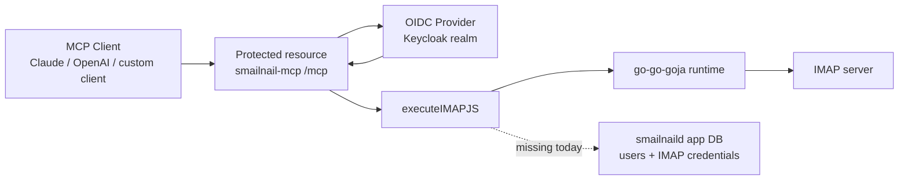
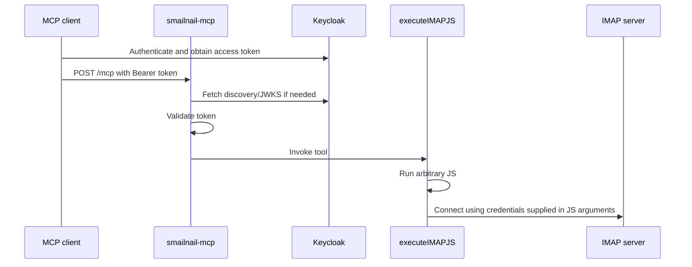
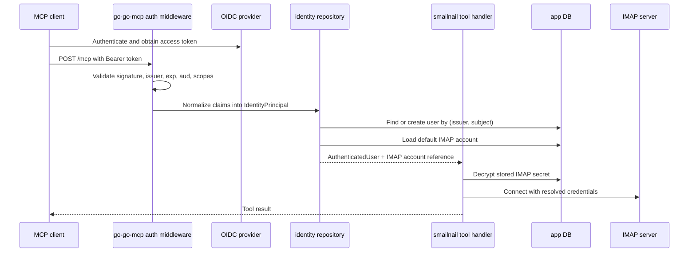

# Intern guide to OIDC identity, user mapping, and IMAP credential storage in smailnail

## Executive summary

Today, `smailnail-mcp` already knows how to reject anonymous requests and how to validate an OIDC bearer token issued by Keycloak. That validation happens in the shared `go-go-mcp` embeddable server layer, not in `smailnail` itself. After validation, however, the authenticated identity is reduced to a very small `AuthPrincipal`, written into request headers, and then effectively discarded. The actual `smailnail` tool execution path still expects raw IMAP credentials in the JavaScript input.

That means the current system has authentication but not application identity binding. In other words, it can answer "is this token valid?" but it cannot yet answer "which local user is this, which IMAP account should they use, and which actions are they allowed to perform?"

The design recommendation in this guide is:

- treat the OIDC provider as a proof source, not as the product database
- identify humans by the pair `(issuer, subject)` rather than by email or `client_id`
- normalize provider claims into an application-level principal model that is not Keycloak-specific
- store IMAP credentials in the `smailnaild` application database, encrypted at rest
- resolve stored IMAP credentials server-side after token validation rather than passing mail passwords through MCP tool arguments

## Why this guide exists

This guide is written for a new intern who needs to understand both the protocol layer and the current codebase. It is intentionally more detailed than a normal design note. The goal is not just to say what to build, but to make clear:

- what OIDC concepts are standard
- what parts of the current behavior are specific to our code
- what parts are specific to Keycloak
- how to design the next iteration so it remains portable to any standards-compliant OIDC provider

## The current hosted setup in plain English

Right now, the hosted deployment has these major pieces:

- a public MCP endpoint at `https://smailnail.mcp.scapegoat.dev/mcp`
- a Keycloak issuer at `https://auth.scapegoat.dev/realms/smailnail`
- shared MCP auth code in `go-go-mcp`
- the actual tool implementation in `smailnail`

At a high level, the flow is:

1. An MCP client discovers that `/mcp` is protected.
2. The client learns which OIDC issuer is authoritative for this protected resource.
3. The client authenticates with the issuer and obtains a bearer token.
4. The client sends that token to `smailnail-mcp`.
5. `go-go-mcp` verifies the token using OIDC discovery and JWKS.
6. `smailnail` receives the request only after token validation.
7. `smailnail` still does not map that authenticated identity to any local mailbox configuration.

The missing step is between `6` and `7`: an application user lookup and IMAP account resolution layer.

## System overview



The current code splits responsibilities across repositories and packages:

- token validation lives in [auth_provider_external.go](/home/manuel/workspaces/2026-03-08/update-imap-mcp/go-go-mcp/pkg/embeddable/auth_provider_external.go)
- MCP HTTP auth wrapping lives in [mcpgo_backend.go](/home/manuel/workspaces/2026-03-08/update-imap-mcp/go-go-mcp/pkg/embeddable/mcpgo_backend.go)
- the minimal current auth principal lives in [auth_provider.go](/home/manuel/workspaces/2026-03-08/update-imap-mcp/go-go-mcp/pkg/embeddable/auth_provider.go)
- tool execution lives in [execute_tool.go](/home/manuel/workspaces/2026-03-08/update-imap-mcp/smailnail/pkg/mcp/imapjs/execute_tool.go)
- the IMAP JavaScript service still takes raw secrets in [service.go](/home/manuel/workspaces/2026-03-08/update-imap-mcp/smailnail/pkg/services/smailnailjs/service.go)
- the future application DB bootstrap already exists in [db.go](/home/manuel/workspaces/2026-03-08/update-imap-mcp/smailnail/pkg/smailnaild/db.go)

## Start with the vocabulary

Before looking at the code, get the terminology straight.

### OIDC issuer

The issuer is the identity authority. In our deployment, that is the Keycloak realm URL:

`https://auth.scapegoat.dev/realms/smailnail`

An OIDC issuer is not just a hostname. It is a security boundary. All claims in a token are interpreted in the context of that issuer.

### Discovery document

The discovery document is a JSON document served at:

`<issuer>/.well-known/openid-configuration`

It tells clients where to find:

- the issuer identifier
- the authorization endpoint
- the token endpoint
- the JWKS endpoint
- optionally the dynamic client registration endpoint

This is standard OIDC discovery, not a Keycloak-specific invention.

### JWKS

JWKS stands for JSON Web Key Set. It is how the issuer publishes the public keys used to verify signed JWTs. The server does not need to call back into Keycloak for every token if it can validate the signature using the published keys.

### Access token

The access token is the bearer token sent to `/mcp`. In this architecture, the MCP server validates the token and uses it as proof that the caller is authorized to access the protected resource.

### ID token

The ID token is for the client and describes the authenticated end user. In many browser-based flows the app uses both an ID token and an access token, but for the MCP server itself the important artifact is usually the access token.

### `sub`

`sub` means subject identifier. This is the stable identifier of the end user within the issuer. In practice:

- it is stable within one issuer or realm
- it is not globally stable across issuers
- it should be treated as opaque
- it is the best primary key for external identity mapping

If you only remember one claim, remember this one.

### `client_id`

`client_id` identifies the OAuth client application, not the human. For example:

- Claude Desktop or OpenAI may have a client identity
- a browser app may have a client identity
- `smailnail-web` and `smailnail-mcp` can be different clients

It is useful for auditing and policy, but it is not the right key for local user lookup.

### `azp`

`azp` stands for authorized party. Some providers include it to name the party to which the token was issued. Our current code uses `azp` first, then `client_id`, then falls back to the first audience entry when deriving `ClientID` in [auth_provider_external.go](/home/manuel/workspaces/2026-03-08/update-imap-mcp/go-go-mcp/pkg/embeddable/auth_provider_external.go#L138).

### `aud`

`aud` is the audience. It says who the token is intended for. If we configure audience enforcement, `go-go-mcp` checks it during validation in [auth_provider_external.go](/home/manuel/workspaces/2026-03-08/update-imap-mcp/go-go-mcp/pkg/embeddable/auth_provider_external.go#L120).

### `scope`

Scopes are coarse-grained permission labels such as `openid`, `profile`, or an application-specific scope. Our current auth provider turns the scope string into a set and enforces required scopes in [auth_provider_external.go](/home/manuel/workspaces/2026-03-08/update-imap-mcp/go-go-mcp/pkg/embeddable/auth_provider_external.go#L131).

### `tenant_id`

`tenant_id` is not a standard OIDC claim. It is a provider-specific or application-specific claim sometimes added by systems such as Azure AD, custom Keycloak mappers, or application gateways. That means:

- you should not assume it exists
- you should not hard-code your product around it
- if present, treat it as optional context, not as the universal user key

In a provider-neutral design, `tenant_id` is one possible external claim that can participate in organization resolution. It should not replace `(issuer, subject)`.

## What the current code actually does

### Step 1: `go-go-mcp` learns the issuer and JWKS

When external OIDC auth is enabled, `go-go-mcp` creates an external auth provider in [auth_provider_external.go](/home/manuel/workspaces/2026-03-08/update-imap-mcp/go-go-mcp/pkg/embeddable/auth_provider_external.go#L56). That code:

- requires `IssuerURL`
- derives a discovery URL if one is not set explicitly
- fetches the discovery document
- requires `issuer` and `jwks_uri`
- initializes a JWKS cache

Conceptually:

```text
config -> discovery document -> jwks_uri -> cached verification keys
```

This is already generic OIDC behavior. Nothing in this step depends on Keycloak-specific JWT formats.

### Step 2: the MCP server advertises that `/mcp` is protected

When auth is enabled, the streamable HTTP backend:

- creates the auth provider
- mounts provider-specific routes if needed
- serves `/.well-known/oauth-protected-resource`
- wraps `/mcp` in auth middleware

That is implemented in [mcpgo_backend.go](/home/manuel/workspaces/2026-03-08/update-imap-mcp/go-go-mcp/pkg/embeddable/mcpgo_backend.go#L247).

This is why clients can discover that:

- the resource is `https://smailnail.mcp.scapegoat.dev/mcp`
- the authorization server is `https://auth.scapegoat.dev/realms/smailnail`

### Step 3: bearer token validation

The auth middleware checks for `Authorization: Bearer ...` and rejects missing or invalid tokens in [mcpgo_backend.go](/home/manuel/workspaces/2026-03-08/update-imap-mcp/go-go-mcp/pkg/embeddable/mcpgo_backend.go#L286).

If a token is present, `ValidateBearerToken`:

- parses the JWT
- resolves keys from JWKS
- validates signature
- validates issuer
- validates expiration
- optionally validates audience
- optionally validates required scopes

The result is a current `AuthPrincipal`:

```go
type AuthPrincipal struct {
    Subject  string
    ClientID string
    Issuer   string
    Scopes   []string
}
```

That type lives in [auth_provider.go](/home/manuel/workspaces/2026-03-08/update-imap-mcp/go-go-mcp/pkg/embeddable/auth_provider.go#L15).

### Step 4: the authenticated principal is barely propagated

After validation, the middleware clones the request and writes:

- `X-MCP-Subject`
- `X-MCP-Client-ID`

into HTTP headers in [mcpgo_backend.go](/home/manuel/workspaces/2026-03-08/update-imap-mcp/go-go-mcp/pkg/embeddable/mcpgo_backend.go#L304).

That is enough for debugging but not enough for a real application model. Problems:

- the principal is not stored in a typed `context.Context` value
- `Issuer` is not propagated downstream
- there is no slot for `email`, `preferred_username`, or `tenant_id`
- tool handlers are not built around a typed principal lookup API

### Step 5: `smailnail` ignores the authenticated user

The tool implementation in [execute_tool.go](/home/manuel/workspaces/2026-03-08/update-imap-mcp/smailnail/pkg/mcp/imapjs/execute_tool.go#L15) just:

- binds arguments from the request
- creates a JavaScript runtime
- loads the `smailnail` module
- executes the caller-supplied code

There is no step like:

- resolve current user
- load that user's mailbox connection
- restrict execution to allowed IMAP accounts

### Step 6: the JS API still expects raw IMAP credentials

`smailnail`'s current JS-facing service still expects this shape:

```go
type ConnectOptions struct {
    Server   string
    Port     int
    Username string
    Password string
    Mailbox  string
    Insecure bool
}
```

That comes from [service.go](/home/manuel/workspaces/2026-03-08/update-imap-mcp/smailnail/pkg/services/smailnailjs/service.go#L39), and the real dialer rejects empty `Username` and `Password` in [service.go](/home/manuel/workspaces/2026-03-08/update-imap-mcp/smailnail/pkg/services/smailnailjs/service.go#L216).

So the current system really works like this:



The validated identity is not used to choose the IMAP credentials.

## What is Keycloak-specific and what is not

This is the most important architectural distinction in the whole guide.

### Standard OIDC concepts

These are standards-based and should remain even if we switch providers:

- issuer
- discovery document
- JWKS
- JWT validation
- `sub`
- `aud`
- `scope`
- client registration concepts
- Authorization Code + PKCE flows

### Keycloak-specific implementation details

These may change if we switch providers:

- how the admin UI is organized
- how social login providers are configured
- how protocol mappers add extra claims
- what default scopes exist
- whether organization or tenant information comes from specific custom claims
- what claims are present by default

### Design rule

The application must consume a provider-neutral identity model and treat Keycloak as one possible issuer. That means:

- do not build local tables keyed only by Keycloak realm-specific metadata
- do not make `tenant_id` mandatory if it is not standard
- do not store business state in Keycloak user attributes if the state belongs to `smailnail`

## Why `(issuer, subject)` is the correct external identity key

`sub` is stable only within an issuer. Two different issuers can issue the same `sub` string for different users. That means:

- `sub` alone is not enough
- `email` alone is not enough
- `client_id` is wrong entirely for user identity

The right key is:

```text
(issuer, subject)
```

Examples:

- `("https://auth.scapegoat.dev/realms/smailnail", "9d0a...")`
- `("https://accounts.example.com", "abc123")`

If we ever switch away from Keycloak, that key still works.

## A provider-neutral identity model

The current `AuthPrincipal` is too small. A provider-neutral application model should look more like:

```go
type IdentityPrincipal struct {
    Issuer            string
    Subject           string
    ClientID          string
    AuthorizedParty   string
    Audience          []string
    Scopes            []string

    Email             string
    EmailVerified     *bool
    PreferredUsername string
    Name              string

    TenantID          string
    OrganizationID    string

    RawClaims         map[string]any
}
```

Important notes:

- `Issuer` and `Subject` are required.
- `ClientID` is useful but not user identity.
- `TenantID` and `OrganizationID` are optional.
- `RawClaims` is useful for debugging and future mappings.

This lets the application normalize claims from:

- Keycloak
- Auth0
- Okta
- Azure AD / Entra
- a custom OIDC provider

without changing the local user table schema every time.

## Local application model versus external identity

An OIDC identity is not the same thing as an application user.

### External identity record

This is what the provider says:

- issuer
- subject
- maybe email
- maybe display name
- maybe org or tenant claims

### Local application user

This is what `smailnail` needs:

- internal user ID
- profile metadata
- account status
- IMAP accounts
- audit history
- preferences

One application user may be linked to one external identity at first, but the design should leave room for:

- multiple external identities per user
- multiple IMAP accounts per user
- organization memberships

## Where IMAP credentials should live

They should live in the `smailnaild` application database, not in Keycloak.

Reasons:

- IMAP credentials are application secrets, not identity-provider state.
- We need app-specific encryption and rotation semantics.
- We may want multiple IMAP accounts per user.
- We need to support either SQLite or Postgres via Clay SQL.
- Keycloak should remain the identity provider, not become a secret vault.

The existing DB bootstrap in [db.go](/home/manuel/workspaces/2026-03-08/update-imap-mcp/smailnail/pkg/smailnaild/db.go#L23) already uses Clay SQL config loading. That makes it the natural home for local user and IMAP tables.

## Recommended database schema

For the first real implementation slice, use tables along these lines.

### `users`

```sql
CREATE TABLE users (
    id TEXT PRIMARY KEY,
    created_at TIMESTAMP NOT NULL,
    updated_at TIMESTAMP NOT NULL,
    display_name TEXT,
    email TEXT,
    email_verified BOOLEAN,
    status TEXT NOT NULL
);
```

### `external_identities`

```sql
CREATE TABLE external_identities (
    id TEXT PRIMARY KEY,
    user_id TEXT NOT NULL REFERENCES users(id),
    issuer TEXT NOT NULL,
    subject TEXT NOT NULL,
    preferred_username TEXT,
    email TEXT,
    tenant_id TEXT,
    organization_id TEXT,
    claims_json TEXT NOT NULL,
    created_at TIMESTAMP NOT NULL,
    updated_at TIMESTAMP NOT NULL,
    UNIQUE (issuer, subject)
);
```

### `imap_accounts`

```sql
CREATE TABLE imap_accounts (
    id TEXT PRIMARY KEY,
    user_id TEXT NOT NULL REFERENCES users(id),
    label TEXT NOT NULL,
    server TEXT NOT NULL,
    port INTEGER NOT NULL,
    username TEXT NOT NULL,
    mailbox_default TEXT NOT NULL,
    insecure BOOLEAN NOT NULL DEFAULT FALSE,
    auth_type TEXT NOT NULL,
    secret_ciphertext BLOB NOT NULL,
    secret_nonce BLOB NOT NULL,
    secret_key_id TEXT NOT NULL,
    created_at TIMESTAMP NOT NULL,
    updated_at TIMESTAMP NOT NULL
);
```

### `user_default_imap_accounts`

```sql
CREATE TABLE user_default_imap_accounts (
    user_id TEXT PRIMARY KEY REFERENCES users(id),
    imap_account_id TEXT NOT NULL REFERENCES imap_accounts(id),
    updated_at TIMESTAMP NOT NULL
);
```

This is intentionally generic SQL. It works with SQLite for MVP and Postgres for production, which fits the existing Clay SQL bootstrap layer in [settings.go](/home/manuel/code/wesen/corporate-headquarters/clay/pkg/sql/settings.go#L23).

## How to encrypt IMAP credentials

Do not store the password in plaintext. Do not store it as a trivially encoded string. Encrypt it before writing to the database.

Recommended model:

- use an application-managed AEAD key
- store ciphertext, nonce, and key ID
- keep the encryption key outside the database
- rotate with a key registry if needed later

For the MVP:

- a single environment variable key is acceptable if handled carefully
- example: `SMAILNAILD_ENCRYPTION_KEY`
- use an AEAD such as XChaCha20-Poly1305 or AES-GCM

Pseudocode:

```go
func encryptSecret(keyID string, key []byte, plaintext string) (ciphertext []byte, nonce []byte, err error) {
    aead := mustNewAEAD(key)
    nonce = randomNonce(aead.NonceSize())
    ciphertext = aead.Seal(nil, nonce, []byte(plaintext), nil)
    return ciphertext, nonce, nil
}

func decryptSecret(key []byte, nonce []byte, ciphertext []byte) (string, error) {
    aead := mustNewAEAD(key)
    plaintext, err := aead.Open(nil, nonce, ciphertext, nil)
    if err != nil {
        return "", err
    }
    return string(plaintext), nil
}
```

## The target request flow

The next iteration should work like this:



The critical design change is that IMAP credentials become server-managed state, not model-provided input.

## Suggested code design

### 1. Expand the auth principal in `go-go-mcp`

Today:

```go
type AuthPrincipal struct {
    Subject  string
    ClientID string
    Issuer   string
    Scopes   []string
}
```

Target:

- include additional claims
- preserve raw claims
- provide a typed context accessor

Pseudocode:

```go
type principalContextKey struct{}

func WithAuthPrincipal(ctx context.Context, p IdentityPrincipal) context.Context {
    return context.WithValue(ctx, principalContextKey{}, p)
}

func GetAuthPrincipal(ctx context.Context) (IdentityPrincipal, bool) {
    p, ok := ctx.Value(principalContextKey{}).(IdentityPrincipal)
    return p, ok
}
```

Then update the middleware in [mcpgo_backend.go](/home/manuel/workspaces/2026-03-08/update-imap-mcp/go-go-mcp/pkg/embeddable/mcpgo_backend.go#L286) so it injects the principal into context, not just headers.

### 2. Normalize provider claims

The validator should parse standard claims and preserve the rest.

Pseudocode:

```go
type externalBearerClaims struct {
    jwt.Claims
    AuthorizedParty   string `json:"azp,omitempty"`
    ClientID          string `json:"client_id,omitempty"`
    Scope             string `json:"scope,omitempty"`
    Email             string `json:"email,omitempty"`
    EmailVerified     *bool  `json:"email_verified,omitempty"`
    PreferredUsername string `json:"preferred_username,omitempty"`
    Name              string `json:"name,omitempty"`
    TenantID          string `json:"tenant_id,omitempty"`
    OrganizationID    string `json:"organization_id,omitempty"`
    SCP               []string `json:"scp,omitempty"`
}
```

If a provider uses different names, a mapping layer can translate those names into the normalized principal.

### 3. Introduce an identity repository in `smailnaild`

This repository should:

- upsert external identity rows
- find or create a local user
- load the user's default IMAP account
- optionally enforce organization membership

Pseudocode:

```go
type IdentityRepository interface {
    FindOrCreateUserFromPrincipal(ctx context.Context, p IdentityPrincipal) (User, error)
    GetDefaultIMAPAccount(ctx context.Context, userID string) (IMAPAccount, error)
}
```

### 4. Remove raw password requirements from MCP JS input

The current `ConnectOptions` shape in [service.go](/home/manuel/workspaces/2026-03-08/update-imap-mcp/smailnail/pkg/services/smailnailjs/service.go#L39) is right for a local CLI or test harness, but wrong for a hosted multi-user service.

For the hosted MCP path, introduce a new execution mode:

- no `password` in JS arguments
- either use the user's default account automatically
- or allow a logical `connection_id`

Example desired API:

```javascript
const smailnail = require("smailnail");
const session = await smailnail.connectDefault();
```

or:

```javascript
const smailnail = require("smailnail");
const session = await smailnail.connectStored({ connectionId: "work-inbox" });
```

The server resolves that to stored encrypted credentials.

## Why not store everything in Keycloak

It is tempting to put IMAP username, password, or connection defaults into Keycloak user attributes. Do not do that unless you are forced to.

Why not:

- wrong system boundary
- awkward encryption/rotation semantics
- hard to support multiple mail accounts cleanly
- difficult to keep app data portable if the IdP changes
- makes local domain modeling dependent on Keycloak administration APIs

The right split is:

- Keycloak stores identity and authentication state
- `smailnaild` stores application state and secrets

## How to think about `tenant_id`

Interns often get confused here because enterprise identity systems expose many IDs.

### What `tenant_id` is

It is usually an organization or directory identifier supplied by a provider or mapper.

### What `tenant_id` is not

It is not a standard universal OIDC claim.

### How to handle it

- make it optional in the normalized principal
- store it as metadata on `external_identities`
- use it only if the product truly needs organization partitioning
- do not use it as the sole local user key

If you later add multi-tenant product behavior, do it with explicit local concepts such as:

- organizations
- memberships
- workspace bindings

and treat `tenant_id` as one possible input to those mappings.

## Suggested implementation phases

### Phase 1: make auth identity typed and accessible

Changes:

- extend the principal structure in `go-go-mcp`
- preserve more claims
- add context helpers
- stop relying on ad hoc headers for downstream identity

Expected outcome:

- tool handlers can ask for the current authenticated principal directly

### Phase 2: add user and identity repositories in `smailnaild`

Changes:

- extend [db.go](/home/manuel/workspaces/2026-03-08/update-imap-mcp/smailnail/pkg/smailnaild/db.go#L127) bootstrap beyond `app_metadata`
- add migrations for `users`, `external_identities`, and `imap_accounts`
- create repository interfaces and SQL implementations

Expected outcome:

- `(issuer, subject)` can be resolved into a local user

### Phase 3: add encrypted IMAP account storage

Changes:

- add secret encryption utilities
- add IMAP account CRUD APIs or CLI commands
- mark one default account per user

Expected outcome:

- the app can connect to IMAP without receiving passwords from MCP tool arguments

### Phase 4: bind MCP execution to stored accounts

Changes:

- update the MCP execution path in [execute_tool.go](/home/manuel/workspaces/2026-03-08/update-imap-mcp/smailnail/pkg/mcp/imapjs/execute_tool.go#L15)
- introduce `connectDefault` or `connectStored`
- load and decrypt the current user's account before dialing

Expected outcome:

- hosted MCP becomes safe and user-aware

### Phase 5: add policy and organization support only if needed

Changes:

- enforce scope-based capabilities
- optionally support local organizations and memberships
- optionally consume `tenant_id` or `organization_id`

Expected outcome:

- multi-user and multi-organization behavior becomes explicit instead of accidental

## Testing plan

Use multiple layers of tests.

### Unit tests

- token claim normalization
- context principal injection and retrieval
- `(issuer, subject)` upsert logic
- secret encryption and decryption
- account resolution logic

### Integration tests

- Keycloak-issued token validates through external OIDC
- a valid principal creates or resolves the correct local user
- the default IMAP account is loaded
- stored credentials are decrypted and used to connect to the hosted Dovecot fixture

### End-to-end tests

- obtain a real Keycloak token
- call the hosted MCP
- run `executeIMAPJS`
- verify the request uses the authenticated user's stored account rather than submitted raw credentials

## Common mistakes to avoid

- keying users by email
- keying users by `client_id`
- assuming `tenant_id` is standard
- storing IMAP passwords in Keycloak user attributes
- passing IMAP passwords through JavaScript forever because it is convenient
- validating tokens correctly but never making the principal available to application code

## Implementation sketch

This is the rough shape of the desired glue code.

```go
func executeIMAPJSHandler(ctx context.Context, raw map[string]interface{}) (*protocol.ToolResult, error) {
    principal, ok := auth.GetAuthPrincipal(ctx)
    if !ok {
        return newErrorToolResult("missing authenticated principal", nil), nil
    }

    user, err := identityRepo.FindOrCreateUserFromPrincipal(ctx, principal)
    if err != nil {
        return newErrorToolResult("failed to resolve user", err), nil
    }

    account, err := identityRepo.GetDefaultIMAPAccount(ctx, user.ID)
    if err != nil {
        return newErrorToolResult("failed to resolve IMAP account", err), nil
    }

    password, err := secrets.Decrypt(account.SecretCiphertext, account.SecretNonce, account.SecretKeyID)
    if err != nil {
        return newErrorToolResult("failed to decrypt IMAP credentials", err), nil
    }

    runtime, err := newRuntimeWithStoredConnection(ctx, account.Server, account.Port, account.Username, password)
    if err != nil {
        return newErrorToolResult("failed to create runtime", err), nil
    }

    return executeWithRuntime(runtime, raw)
}
```

## Reading map for the intern

If you are new to the codebase, read in this order:

1. [auth_provider.go](/home/manuel/workspaces/2026-03-08/update-imap-mcp/go-go-mcp/pkg/embeddable/auth_provider.go)
2. [auth_provider_external.go](/home/manuel/workspaces/2026-03-08/update-imap-mcp/go-go-mcp/pkg/embeddable/auth_provider_external.go)
3. [mcpgo_backend.go](/home/manuel/workspaces/2026-03-08/update-imap-mcp/go-go-mcp/pkg/embeddable/mcpgo_backend.go)
4. [execute_tool.go](/home/manuel/workspaces/2026-03-08/update-imap-mcp/smailnail/pkg/mcp/imapjs/execute_tool.go)
5. [service.go](/home/manuel/workspaces/2026-03-08/update-imap-mcp/smailnail/pkg/services/smailnailjs/service.go)
6. [db.go](/home/manuel/workspaces/2026-03-08/update-imap-mcp/smailnail/pkg/smailnaild/db.go)
7. [settings.go](/home/manuel/code/wesen/corporate-headquarters/clay/pkg/sql/settings.go)

By the time you finish those files, the architecture in this document should feel concrete rather than abstract.

## Open questions

- Should `go-go-mcp` own the richer normalized identity type, or should it expose raw claims and let each app normalize them?
- Should the hosted MCP path forbid direct raw IMAP credentials entirely, or keep a separate dev-only escape hatch?
- Should local organization membership be introduced now, or delayed until the first real multi-tenant requirement appears?
- What key management mechanism should replace the single-environment-variable encryption key in production?

## References

- OpenID Connect Core 1.0: https://openid.net/specs/openid-connect-core-1_0.html
- OpenID Connect Discovery 1.0: https://openid.net/specs/openid-connect-discovery-1_0.html
- OAuth 2.0: https://datatracker.ietf.org/doc/html/rfc6749
- JSON Web Token (JWT): https://datatracker.ietf.org/doc/html/rfc7519
- Keycloak Server Administration Guide: https://www.keycloak.org/docs/latest/server_admin/#assembly-managing-clients_server_administration_guide
