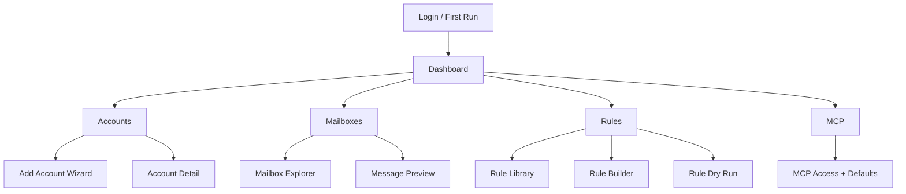

# Intern guide to smailnail web UI UX, architecture, and implementation for hosted MCP mail management

## Executive summary

`smailnail` already has the core machinery for talking to IMAP servers, fetching messages, expressing search and action rules in a DSL, and exposing a JavaScript runtime over MCP. What it does not yet have is the product layer that makes those capabilities usable by normal humans in a browser.

The next major product slice is not "build a settings page." It is "turn `smailnail` into a hosted mail operations workbench." That means the web UI must help users:

- connect one or more IMAP accounts safely
- understand whether those accounts are actually usable
- inspect mailboxes and recent messages enough to build trust
- create and test reusable rules and filters
- decide which saved accounts and rules the MCP runtime should use
- understand failures, capabilities, and risk before they trigger message-moving actions

The key recommendation in this guide is to build the UI from user needs outward. The product should start with four primary workflows:

1. Add and validate an IMAP account.
2. Browse mailbox structure and preview messages.
3. Create, test, and save rules.
4. Expose saved accounts and rules to the hosted MCP path in a controlled way.

Everything else, including screen layout and API shape, follows from those workflows.

## Why this guide exists

This guide is for a new intern who needs to understand:

- what the current codebase can already do
- what is missing from the hosted product
- what user problems the UI should solve first
- how UX, storage, backend APIs, and MCP identity all fit together

The aim is not just to list screens. It is to explain the whole system end to end so implementation choices are grounded in actual product needs rather than arbitrary frontend patterns.

## Current product reality

Today the repository provides:

- a CLI for fetching mail and processing YAML rules
- a JavaScript module for building rules and connecting to IMAP
- an MCP server exposing JavaScript execution and documentation
- a minimal hosted `smailnaild` skeleton with only `/healthz`, `/readyz`, and `/api/info`

This is visible in:

- [http.go](/home/manuel/workspaces/2026-03-08/update-imap-mcp/smailnail/pkg/smailnaild/http.go)
- [serve.go](/home/manuel/workspaces/2026-03-08/update-imap-mcp/smailnail/cmd/smailnaild/commands/serve.go)
- [server.go](/home/manuel/workspaces/2026-03-08/update-imap-mcp/smailnail/pkg/mcp/imapjs/server.go)
- [module.go](/home/manuel/workspaces/2026-03-08/update-imap-mcp/smailnail/pkg/js/modules/smailnail/module.go)

The result is that the current hosted surface proves a process boundary, not a usable application.

## The product problem

If you imagine the eventual user as a real person and not as a code snippet, they are not trying to "call executeIMAPJS." They are trying to do things like:

- "Connect my work inbox and see if this app can read it."
- "Keep my personal and work inboxes separate."
- "Search for invoices and tag or move them."
- "Preview what a filter would match before it changes mail."
- "See whether this account uses normal password login, app password login, or something more modern."
- "Tell Claude or another MCP client to work with the account I already configured in the web app."

The product therefore needs to solve trust, clarity, and safety before it solves automation.

## Start from user needs, not screens

The most reliable way to design this UI is to identify the user needs first and derive the UI from them.

## Primary user types

### User type 1: the individual power user

This user wants to connect one or two inboxes and run searches, filters, or exports without writing a lot of YAML by hand.

Needs:

- easy account onboarding
- clear test/validation feedback
- safe rule preview before any destructive action
- a simple way to make one account the default for MCP use

### User type 2: the consultant or operator with multiple inboxes

This user may have:

- multiple workspaces
- multiple accounts across providers
- test and production inboxes
- rules that should only apply to one account or mailbox

Needs:

- multi-account management
- strong account labeling
- capability/status visibility per account
- a rule library with account binding

### User type 3: the automation user

This user primarily wants MCP and AI tools to operate on preconfigured mail accounts.

Needs:

- confidence that MCP will use the right saved account
- visibility into which accounts and rules are exposed to automation
- auditability of what MCP-triggered actions did

## Core user needs

These needs should drive the product:

1. I need to connect my inbox successfully.
2. I need to know whether the connection is safe and valid.
3. I need to inspect enough real mail to trust the tool.
4. I need to define a repeatable rule without memorizing YAML.
5. I need to test the rule safely on sample messages.
6. I need to understand what account and mailbox a rule applies to.
7. I need to manage multiple accounts without confusion.
8. I need the MCP layer to reuse those stored accounts rather than asking for raw passwords.

## Derived product principles

From those needs, the product should follow these principles:

- show status before exposing complexity
- separate read-only testing from write operations
- make account scope visible everywhere
- make destructive actions explicit
- support multiple accounts as a first-class concept
- preserve the underlying DSL and JavaScript power for advanced users, but do not make them the only UI

## Current technical capabilities we can reuse

The encouraging part is that most of the backend primitives already exist.

### IMAP connection primitive

[layer.go](/home/manuel/workspaces/2026-03-08/update-imap-mcp/smailnail/pkg/imap/layer.go) already defines:

- `server`
- `port`
- `username`
- `password`
- `mailbox`
- `insecure`

and uses `imapclient.DialTLS` plus `Login`. That is enough to implement account validation and mailbox browsing APIs.

### Rule model

[types.go](/home/manuel/workspaces/2026-03-08/update-imap-mcp/smailnail/pkg/dsl/types.go) already models:

- search criteria
- pagination
- field selection
- MIME filtering
- actions

That means the UI does not need a brand new rule engine. It needs an editor and preview flow for the existing one.

### Efficient message fetch path

[processor.go](/home/manuel/workspaces/2026-03-08/update-imap-mcp/smailnail/pkg/dsl/processor.go) already has:

- IMAP search conversion
- metadata fetch
- MIME-part fetch
- pagination via `limit`, `offset`, `after_uid`, and `before_uid`

That is exactly what an inbox preview screen needs.

### Rule actions

[actions.go](/home/manuel/workspaces/2026-03-08/update-imap-mcp/smailnail/pkg/dsl/actions.go) already supports:

- flag add/remove
- copy
- move
- delete or trash
- export

The web UI should expose those cautiously and with dry-run previews.

### Hosted process boundary and DB bootstrap

[serve.go](/home/manuel/workspaces/2026-03-08/update-imap-mcp/smailnail/cmd/smailnaild/commands/serve.go) and [db.go](/home/manuel/workspaces/2026-03-08/update-imap-mcp/smailnail/pkg/smailnaild/db.go) already prove:

- a hosted Go process exists
- it can open a Clay SQL-backed database
- it can default to SQLite or point to Postgres

That is the right place to add hosted APIs and stored account state.

## External constraints that affect UX

The UI cannot assume every provider behaves the same way.

### Google/Gmail

Google’s official docs indicate:

- IMAP access must be enabled on the mailbox
- many users need an app password rather than their normal password

Sources:

- Google IMAP setup: https://support.google.com/mail/answer/7126229
- Google app passwords: https://support.google.com/accounts/answer/185833

UX implication:

- the account setup flow should include provider-specific hints
- "password" should often be labeled "password or app password"
- connection failures should offer Gmail-specific remediation text

### Microsoft / Exchange Online / Outlook

Microsoft has officially deprecated basic authentication for Exchange Online. That means naive username/password IMAP will fail for many Microsoft-hosted mailboxes.

Source:

- https://learn.microsoft.com/en-us/exchange/clients-and-mobile-in-exchange-online/deprecation-of-basic-authentication-exchange-online

UX implication:

- the web UI should detect `outlook.com`, `office365.com`, or similar domains and warn that basic IMAP credentials may not work
- the product roadmap should include OAuth-based provider connectors later
- the first version should still allow manual setup, but with explicit caveats

### Established mail clients

Apple Mail’s user-facing docs make two things very visible:

- adding multiple mail accounts is a first-class flow
- "All Inboxes" and Smart Mailboxes are important organizing concepts

Sources:

- Add accounts: https://support.apple.com/en-us/102578
- All Inboxes and mailbox list behavior: https://support.apple.com/en-il/guide/mail/mlhlp1040/mac
- Smart Mailboxes: https://support.apple.com/en-il/guide/mail/mlhlp1190/mac

UX implication:

- users expect a multi-account sidebar
- they expect a combined high-level overview even if each account remains separately configured
- they expect filters/smart views to be reusable and inspectable

### IMAP protocol constraints

IMAP itself is mailbox-oriented and server-driven. The relevant protocol foundation is RFC 3501.

Source:

- https://datatracker.ietf.org/doc/html/rfc3501

UX implication:

- mailbox lists may be large or nested
- operations may succeed differently depending on server capabilities
- some write operations should be probed separately from read operations

## Product scope recommendation

The hosted UI should be conceived as five product areas.

1. Authentication and onboarding
2. Account management
3. Mailbox and message exploration
4. Rule and filter management
5. MCP integration and audit visibility

## Recommended MVP

For the first serious web UI slice, do not try to build a full webmail client. Build an operations console.

The MVP should include:

- sign-in
- account list
- add/edit/delete account
- test account connection
- list mailboxes
- preview recent messages in a mailbox
- create and save rules
- dry-run rule preview
- explicit "execute actions" confirmation
- mark an account as MCP-usable default

The MVP should not include:

- full message composition
- threaded conversation UI
- permanent live sync
- rich folder drag-and-drop
- collaborative workspaces

## Information architecture

Recommended top-level app navigation:

- Dashboard
- Accounts
- Mailboxes
- Rules
- MCP
- Settings

## Screen map



## Screen designs

The screens below are ASCII wireframes. They are not meant to dictate styling. They are meant to make layout and information density concrete.

### Screen 1: first-run dashboard

User need:

- I just logged in and need to know what to do next.

```text
+----------------------------------------------------------------------------------+
| smailnail                                                     [User] [Settings] |
+----------------------------------------------------------------------------------+
| Dashboard                                                                        |
|----------------------------------------------------------------------------------|
| Welcome back. smailnail manages saved IMAP accounts, mailbox previews, rules,   |
| and MCP-backed automations.                                                      |
|                                                                                  |
| +---------------------------+ +--------------------------+ +-------------------+ |
| | Accounts                  | | Rules                    | | MCP               | |
| | 0 connected               | | 0 saved                  | | Not configured    | |
| | [Add first account]       | | [Create first rule]      | | [Review setup]    | |
| +---------------------------+ +--------------------------+ +-------------------+ |
|                                                                                  |
| Recent activity                                                                  |
| - No successful account tests yet                                                |
| - No mailbox previews yet                                                        |
| - No MCP account default selected                                                |
+----------------------------------------------------------------------------------+
```

### Screen 2: account list

User need:

- I need to manage multiple servers and understand their status quickly.

```text
+----------------------------------------------------------------------------------+
| Accounts                                                          [Add account] |
+----------------------------------------------------------------------------------+
| Name        Provider    Server                  Default  Status       Last test  |
|----------------------------------------------------------------------------------|
| Work        Gmail       imap.gmail.com:993      Yes      Warning      2m ago     |
| Personal    Fastmail    imap.fastmail.com:993   No       Healthy      1h ago     |
| Lab         Dovecot     mail.lab.local:993      No       Failed       Never      |
|----------------------------------------------------------------------------------|
| Legend: Healthy = read test passed, Warning = provider caveat, Failed = action  |
| required                                                                           |
+----------------------------------------------------------------------------------+
```

### Screen 3: add account wizard

User need:

- I need help entering the right credentials and understanding what kind of test is being performed.

```text
+----------------------------------------------------------------------------------+
| Add account: Step 1 of 3                                                         |
+----------------------------------------------------------------------------------+
| Label:              [ Work Gmail                                      ]          |
| Provider preset:    [ Gmail v ]                                                   |
| IMAP server:        [ imap.gmail.com                                ]  Port [993]|
| Username:           [ user@example.com                             ]             |
| Password/app pass:  [ ***************************                  ]             |
| Mailbox default:    [ INBOX                                         ]           |
| Skip TLS verify:    [ ] (dev/test only)                                             |
|                                                                                  |
| Provider notes                                                                   |
| - Gmail requires IMAP enabled in mailbox settings                                |
| - Many accounts require a Google app password                                    |
|                                                                                  |
| [Cancel]                                              [Test read-only] [Next]    |
+----------------------------------------------------------------------------------+
```

### Screen 4: account test results

User need:

- I need to know exactly what worked and what failed before I save the account.

```text
+----------------------------------------------------------------------------------+
| Account test: Work Gmail                                                         |
+----------------------------------------------------------------------------------+
| Read-only test result: PARTIAL SUCCESS                                           |
|                                                                                  |
| [x] TCP/TLS connection established                                               |
| [x] Login accepted                                                               |
| [x] INBOX selected                                                               |
| [x] 10 mailboxes listed                                                          |
| [x] 5 recent headers fetched                                                     |
| [ ] Write-capability probe not run                                               |
|                                                                                  |
| Warning                                                                          |
| - This provider may require app passwords or OAuth for long-term reliability     |
|                                                                                  |
| [Save account] [Run write test] [Back]                                           |
+----------------------------------------------------------------------------------+
```

### Screen 5: mailbox explorer

User need:

- I need to browse folders and confirm the account contains the mail I expect.

```text
+----------------------------------------------------------------------------------+
| Mailboxes: Work Gmail                                         Account [Work v]   |
+----------------------------------------------------------------------------------+
| Folders                     | Message list                                         |
|----------------------------|------------------------------------------------------|
| > All Inboxes              | Mailbox: INBOX                                       |
| > Work                     | Search [ invoice                ] [Unread] [Run]     |
|   - INBOX                  |------------------------------------------------------|
|   - Archive                | UID     Date        From              Subject         |
|   - Receipts               | 91230   2026-03-15  Billing Co        Invoice 9381   |
| > Personal                 | 91228   2026-03-15  Ops Team          Deploy report   |
|   - INBOX                  | 91220   2026-03-14  Alerts            CPU warning     |
|                            |------------------------------------------------------|
|                            | [Preview selected] [Use as rule sample]              |
+----------------------------------------------------------------------------------+
```

### Screen 6: message preview

User need:

- I need enough detail to verify that my rules will match the right content.

```text
+----------------------------------------------------------------------------------+
| Message preview                                                                  |
+----------------------------------------------------------------------------------+
| Account: Work Gmail     Mailbox: INBOX      UID: 91230                           |
| From: Billing Co <billing@example.com>                                           |
| Subject: Invoice 9381                                                             |
| Date: 2026-03-15T12:11:00Z                                                       |
| Flags: Seen                                                                      |
|                                                                                  |
| Plain text preview                                                               |
| -------------------------------------------------------------------------------- |
| Hello, your invoice for March is attached...                                     |
|                                                                                  |
| MIME parts                                                                       |
| - text/plain                                                                     |
| - text/html                                                                      |
| - application/pdf                                                                |
|                                                                                  |
| [Back] [Use in rule test]                                                        |
+----------------------------------------------------------------------------------+
```

### Screen 7: rule library

User need:

- I need to see all saved filters and which accounts they apply to.

```text
+----------------------------------------------------------------------------------+
| Rules                                                        [New rule] [Import] |
+----------------------------------------------------------------------------------+
| Name               Scope            Type         Last result      Status          |
|----------------------------------------------------------------------------------|
| Invoice triage     Work / INBOX     Dry-run      12 matches       Healthy         |
| VIP unread         Personal / INBOX Action rule  2 matches        Needs review    |
| Weekly export      Work / Reports   Export rule  Never run        Draft           |
|----------------------------------------------------------------------------------|
| Filter: [All accounts v] [All statuses v] [Search rule name             ]        |
+----------------------------------------------------------------------------------+
```

### Screen 8: rule builder

User need:

- I need to create a rule without hand-writing YAML, while still being able to inspect the underlying structure.

```text
+----------------------------------------------------------------------------------+
| Rule builder: Invoice triage                                                     |
+----------------------------------------------------------------------------------+
| Scope                                                                            |
| Account [Work v]   Mailbox [INBOX v]                                            |
|                                                                                  |
| Search                                                                            |
| Subject contains    [ invoice                                   ]                |
| From contains       [                                           ]                |
| Body contains       [                                           ]                |
| Within days         [ 30 ]                                                        |
| Must have flags     [ unread, flagged                         ]                  |
|                                                                                  |
| Output                                                                           |
| Limit [ 20 ]   Include content [x]   MIME filter [text/plain v]                 |
|                                                                                  |
| Actions                                                                          |
| [ ] Add flag   [ ] Remove flag   [x] Move to mailbox [Receipts v]               |
| [ ] Copy to    [ ] Delete   [ ] Export                                           |
|                                                                                  |
| YAML preview                                                                     |
| -------------------------------------------------------------------------------- |
| name: "Invoice triage"                                                           |
| search:                                                                          |
|   subject_contains: "invoice"                                                    |
|   within_days: 30                                                                |
| actions:                                                                         |
|   move_to: "Receipts"                                                            |
|                                                                                  |
| [Save draft] [Dry run] [Execute with confirmation]                               |
+----------------------------------------------------------------------------------+
```

### Screen 9: dry-run results

User need:

- I need to preview matches before any move, flag, delete, or export happens.

```text
+----------------------------------------------------------------------------------+
| Dry run results: Invoice triage                                                  |
+----------------------------------------------------------------------------------+
| Account: Work Gmail   Mailbox: INBOX   Rule status: Draft                        |
| 12 messages would match. 12 messages would be moved to Receipts.                 |
|----------------------------------------------------------------------------------|
| UID     Date        From              Subject                    Why matched      |
| 91230   2026-03-15  Billing Co        Invoice 9381               subject, date    |
| 91192   2026-03-14  Billing Co        Invoice 9380               subject, date    |
| ...                                                                              |
|----------------------------------------------------------------------------------|
| [Back to edit] [Save rule] [Confirm execute]                                     |
+----------------------------------------------------------------------------------+
```

### Screen 10: MCP integration screen

User need:

- I need to understand what the MCP layer will be allowed to use.

```text
+----------------------------------------------------------------------------------+
| MCP integration                                                                  |
+----------------------------------------------------------------------------------+
| Default MCP account:      [ Work Gmail v ]                                       |
| Allowed MCP accounts:     [x] Work Gmail  [x] Personal  [ ] Lab                  |
| Allowed saved rules:      [x] Invoice triage  [x] Weekly export  [ ] Drafts      |
|                                                                                  |
| Current behavior                                                                  |
| - MCP uses your authenticated identity                                            |
| - It should resolve stored accounts by your user record                           |
| - It should not require raw IMAP passwords in tool calls                          |
|                                                                                  |
| Recent MCP activity                                                               |
| 2026-03-16 09:20  executeIMAPJS  Work Gmail   success                             |
| 2026-03-16 09:18  executeIMAPJS  Personal     denied: no access                   |
|                                                                                  |
| [Save policy]                                                                    |
+----------------------------------------------------------------------------------+
```

## What features fall out of those screens

From the user needs and the screen concepts, we can derive concrete features.

## Feature set 1: account lifecycle

Must have:

- create account
- edit account
- delete account
- label account
- choose default mailbox
- mark account as default for MCP
- archive rather than hard-delete account if used by rules or audit logs

Should have:

- provider presets
- connection status history
- capability summary

## Feature set 2: connection validation

Read-only validation:

- open TCP/TLS connection
- authenticate
- select configured mailbox
- list mailboxes
- fetch a few recent message headers

Optional write validation:

- create a temporary mailbox
- copy or append a probe message
- remove the temporary mailbox

Important UX rule:

- read-only validation should be the default
- write validation should require explicit opt-in

## Feature set 3: mailbox exploration

Must have:

- list mailboxes
- select mailbox
- fetch paginated headers
- search within mailbox using the existing rule engine
- preview MIME-part-aware content snippets

Nice to have:

- combined "All Inboxes" virtual view across accounts
- saved mailbox favorites

## Feature set 4: rule management

Must have:

- create/edit/delete rule
- bind a rule to one or more accounts or one mailbox
- dry-run preview
- save as draft or active
- display YAML/JSON representation

Should have:

- rule templates
- clone rule
- import/export YAML

## Feature set 5: MCP policy and visibility

Must have:

- choose which accounts MCP may use
- choose default account for MCP
- later choose which rules MCP may invoke
- show recent MCP activity

This matters because the hosted web app and the hosted MCP path must converge on the same stored account model.

## Data model recommendation

The UI needs more structure than the current `app_metadata` table in [db.go](/home/manuel/workspaces/2026-03-08/update-imap-mcp/smailnail/pkg/smailnaild/db.go#L127).

Recommended tables:

- `users`
- `external_identities`
- `imap_accounts`
- `imap_account_tests`
- `mailbox_snapshots`
- `rules`
- `rule_runs`
- `mcp_account_policies`
- `audit_events`

### `imap_accounts`

Purpose:

- one row per saved IMAP account
- multiple rows per user allowed

Suggested columns:

```sql
CREATE TABLE imap_accounts (
    id TEXT PRIMARY KEY,
    user_id TEXT NOT NULL,
    label TEXT NOT NULL,
    provider_hint TEXT,
    server TEXT NOT NULL,
    port INTEGER NOT NULL,
    username TEXT NOT NULL,
    mailbox_default TEXT NOT NULL,
    insecure BOOLEAN NOT NULL DEFAULT FALSE,
    auth_kind TEXT NOT NULL,
    secret_ciphertext BLOB NOT NULL,
    secret_nonce BLOB NOT NULL,
    secret_key_id TEXT NOT NULL,
    is_default BOOLEAN NOT NULL DEFAULT FALSE,
    mcp_enabled BOOLEAN NOT NULL DEFAULT FALSE,
    created_at TIMESTAMP NOT NULL,
    updated_at TIMESTAMP NOT NULL
);
```

### `imap_account_tests`

Purpose:

- store structured test results
- support UI status badges

Suggested columns:

```sql
CREATE TABLE imap_account_tests (
    id TEXT PRIMARY KEY,
    imap_account_id TEXT NOT NULL,
    test_mode TEXT NOT NULL,
    success BOOLEAN NOT NULL,
    tcp_ok BOOLEAN NOT NULL,
    login_ok BOOLEAN NOT NULL,
    mailbox_select_ok BOOLEAN NOT NULL,
    list_ok BOOLEAN NOT NULL,
    sample_fetch_ok BOOLEAN NOT NULL,
    write_probe_ok BOOLEAN,
    warning_code TEXT,
    error_code TEXT,
    error_message TEXT,
    details_json TEXT NOT NULL,
    created_at TIMESTAMP NOT NULL
);
```

### `rules`

Purpose:

- store UI-created and imported rules
- keep account scope visible

Suggested columns:

```sql
CREATE TABLE rules (
    id TEXT PRIMARY KEY,
    user_id TEXT NOT NULL,
    imap_account_id TEXT,
    name TEXT NOT NULL,
    description TEXT,
    status TEXT NOT NULL,
    source_kind TEXT NOT NULL,
    rule_yaml TEXT NOT NULL,
    last_preview_count INTEGER,
    last_run_at TIMESTAMP,
    created_at TIMESTAMP NOT NULL,
    updated_at TIMESTAMP NOT NULL
);
```

### `rule_runs`

Purpose:

- audit previews and live executions
- support dry-run history

Suggested columns:

```sql
CREATE TABLE rule_runs (
    id TEXT PRIMARY KEY,
    rule_id TEXT NOT NULL,
    user_id TEXT NOT NULL,
    imap_account_id TEXT NOT NULL,
    mode TEXT NOT NULL,
    matched_count INTEGER NOT NULL,
    action_summary_json TEXT NOT NULL,
    sample_results_json TEXT NOT NULL,
    created_at TIMESTAMP NOT NULL
);
```

## Storage and security

The account password should be encrypted at rest in the app DB, not stored in Keycloak and not retained in cleartext logs.

Guidance inherited from the earlier identity work:

- keep Keycloak for identity
- keep `smailnaild` for application state
- key users by `(issuer, subject)`
- store IMAP secrets in encrypted app-owned tables

That earlier reasoning is documented in [01-intern-guide-to-oidc-identity-user-mapping-and-imap-credential-storage-in-smailnail.md](/home/manuel/workspaces/2026-03-08/update-imap-mcp/go-go-mcp/ttmp/2026/03/16/SMAILNAIL-011-OIDC-IDENTITY-CREDENTIALS-GUIDE--explain-oidc-identity-user-mapping-and-imap-credential-storage-design-for-smailnail/design-doc/01-intern-guide-to-oidc-identity-user-mapping-and-imap-credential-storage-in-smailnail.md).

## API design recommendation

The easiest way to keep the system coherent is to make `smailnaild` the single hosted backend for:

- browser UI
- stored account management
- mailbox preview APIs
- rule management APIs
- eventually the hosted MCP surface

## Proposed HTTP API

### Accounts

- `GET /api/accounts`
- `POST /api/accounts`
- `GET /api/accounts/:id`
- `PATCH /api/accounts/:id`
- `DELETE /api/accounts/:id`
- `POST /api/accounts/:id/test`
- `GET /api/accounts/:id/mailboxes`
- `GET /api/accounts/:id/messages`
- `GET /api/accounts/:id/messages/:uid`

### Rules

- `GET /api/rules`
- `POST /api/rules`
- `GET /api/rules/:id`
- `PATCH /api/rules/:id`
- `DELETE /api/rules/:id`
- `POST /api/rules/:id/dry-run`
- `POST /api/rules/:id/execute`

### MCP policy

- `GET /api/mcp/policy`
- `PUT /api/mcp/policy`
- `GET /api/mcp/activity`

### Example payloads

Create account:

```json
{
  "label": "Work Gmail",
  "providerHint": "gmail",
  "server": "imap.gmail.com",
  "port": 993,
  "username": "user@example.com",
  "password": "app-password-here",
  "mailboxDefault": "INBOX",
  "insecure": false
}
```

Account test response:

```json
{
  "mode": "read_only",
  "success": true,
  "checks": {
    "tcp": true,
    "login": true,
    "mailboxSelect": true,
    "list": true,
    "sampleFetch": true,
    "writeProbe": null
  },
  "warnings": [
    {
      "code": "provider-app-password-recommended",
      "message": "This provider may require an app password for long-term reliability."
    }
  ],
  "sampleMailboxes": ["INBOX", "Archive", "Receipts"]
}
```

Dry-run request:

```json
{
  "accountId": "acc_work_gmail",
  "ruleYaml": "name: Invoice triage\nsearch:\n  subject_contains: invoice\noutput:\n  format: json\n  limit: 20\n  fields:\n    - subject\n    - from\n"
}
```

## Backend service design

Do not cram all business logic into handlers. Introduce service layers.

Suggested packages:

- `pkg/smailnaild/accounts`
- `pkg/smailnaild/mailboxes`
- `pkg/smailnaild/rules`
- `pkg/smailnaild/audit`
- `pkg/smailnaild/web`

Suggested interfaces:

```go
type AccountService interface {
    CreateAccount(ctx context.Context, user UserID, input CreateAccountInput) (IMAPAccount, error)
    TestAccount(ctx context.Context, user UserID, accountID string, mode TestMode) (AccountTestResult, error)
    ListMailboxes(ctx context.Context, user UserID, accountID string) ([]MailboxNode, error)
    PreviewMessages(ctx context.Context, user UserID, accountID string, mailbox string, query PreviewQuery) (MessagePage, error)
}

type RuleService interface {
    SaveRule(ctx context.Context, user UserID, input SaveRuleInput) (Rule, error)
    DryRunRule(ctx context.Context, user UserID, ruleID string, input DryRunInput) (DryRunResult, error)
    ExecuteRule(ctx context.Context, user UserID, ruleID string, input ExecuteRuleInput) (RuleRunResult, error)
}
```

## How to reuse the current code instead of rewriting it

The UI backend should adapt the current domain code.

### For account tests

Reuse [layer.go](/home/manuel/workspaces/2026-03-08/update-imap-mcp/smailnail/pkg/imap/layer.go#L67) for connection and login, but wrap it so:

- passwords are decrypted server-side
- errors are normalized into UX-friendly codes
- optional mailbox-list and sample-fetch checks happen after login

### For mailbox previews

Reuse [processor.go](/home/manuel/workspaces/2026-03-08/update-imap-mcp/smailnail/pkg/dsl/processor.go#L49) with a generated read-only rule that fetches:

- subject
- from
- date
- flags
- limited MIME content preview

### For rule editing

Reuse [types.go](/home/manuel/workspaces/2026-03-08/update-imap-mcp/smailnail/pkg/dsl/types.go#L21) as the source of truth.

The UI builder should emit a valid YAML rule using the existing schema.

### For MCP exposure

Reuse [server.go](/home/manuel/workspaces/2026-03-08/update-imap-mcp/smailnail/pkg/mcp/imapjs/server.go#L8) conceptually, but ultimately change the runtime so it resolves stored accounts rather than asking the user for raw credentials.

## Recommended frontend architecture

Given the number of screens and the need for:

- dynamic forms
- dry-run previews
- multi-pane mailbox browsing
- rule preview diffs

a small SPA is the pragmatic choice.

Recommendation:

- React + Vite frontend
- compiled and embedded into `smailnaild`
- `/api/*` served by Go
- `/` served by the embedded frontend

Why not server-render everything?

- The mailbox explorer and rule builder benefit from richer client-side state.
- Dry-run previews and form wizard steps are easier in a SPA.

Why not build a giant frontend first?

- We only need an operations console, not a full mail client.
- The first cut should favor clarity and safety over visual ambition.

## UX details that matter

### Make scope visible everywhere

Every rule and every mailbox preview should clearly show:

- account label
- server
- mailbox

This avoids dangerous ambiguity when multiple accounts are connected.

### Keep write actions behind confirmation

Moving, deleting, or exporting mail should never be the primary button on first contact. The product should strongly prefer:

- create/edit rule
- dry-run rule
- explicit confirm execute

### Show provider-specific setup hints

If the server or username suggests Gmail, Outlook, or another known provider, show setup guidance inline rather than burying it in docs.

### Preserve expert escape hatches

Power users should still be able to:

- inspect raw YAML
- import/export rule YAML
- see raw test errors

But the default path should remain guided.

## Testing strategy for the UI

The product has three layers of testing:

### 1. Unit tests

- form validation
- rule builder serialization
- account test result mapping
- provider hint resolution

### 2. Backend integration tests

Against the local or hosted Dovecot fixture:

- create account
- test account
- list mailboxes
- fetch preview messages
- dry-run a rule
- execute a safe copy/move rule

### 3. End-to-end UI tests

Using Playwright or equivalent:

- login
- add account
- run read-only test
- open mailbox explorer
- create rule
- dry run
- confirm execution

## Implementation phases

### Phase 1: hosted backend primitives

Build:

- account CRUD
- account encryption
- account test API
- mailbox list API
- preview messages API

Outcome:

- the browser can connect and inspect accounts before rules exist

### Phase 2: rule CRUD and dry-run

Build:

- rule table
- rule save/load APIs
- rule builder UI
- rule dry-run preview

Outcome:

- the product is already useful without MCP

### Phase 3: MCP policy binding

Build:

- default account selection
- account allowlist for MCP
- activity log
- stored-account resolution in MCP execution

Outcome:

- MCP becomes a consumer of the same hosted configuration model

### Phase 4: richer mailbox views

Build:

- combined inbox overview
- saved smart views
- rule templates

Outcome:

- the UI starts to feel like a coherent mail operations console

## Pseudocode for the most important flows

### Account test flow

```go
func (s *AccountService) TestAccount(ctx context.Context, user UserID, accountID string, mode TestMode) (AccountTestResult, error) {
    account := mustLoadOwnedAccount(user, accountID)
    password := secrets.Decrypt(account.SecretCiphertext, account.SecretNonce, account.SecretKeyID)

    result := AccountTestResult{}

    client, err := dialIMAP(account.Server, account.Port, account.Username, password, account.Insecure)
    if err != nil {
        result.ErrorCode = classifyIMAPError(err)
        return persistTestResult(result), nil
    }
    result.TCPOK = true
    result.LoginOK = true

    if err := selectMailbox(client, account.MailboxDefault); err == nil {
        result.MailboxSelectOK = true
    }

    mailboxes, _ := listMailboxes(client)
    result.ListOK = len(mailboxes) > 0
    result.SampleMailboxes = firstN(mailboxes, 10)

    headers, _ := fetchRecentHeaders(client, account.MailboxDefault, 5)
    result.SampleFetchOK = len(headers) > 0

    if mode == TestModeWriteProbe {
        result.WriteProbeOK = runSafeWriteProbe(client)
    }

    return persistTestResult(result), nil
}
```

### Rule dry-run flow

```go
func (s *RuleService) DryRunRule(ctx context.Context, user UserID, ruleID string, input DryRunInput) (DryRunResult, error) {
    rule := mustLoadOwnedRule(user, ruleID)
    account := mustLoadOwnedAccount(user, input.AccountID)
    client := mustOpenAccountClient(account)

    parsedRule := mustParseRule(rule.RuleYAML)
    messages := mustFetchMessages(parsedRule, client)

    return DryRunResult{
        MatchedCount: len(messages),
        SampleRows:   summarizeMessages(messages, 20),
        ActionPlan:   summarizeRuleActions(parsedRule.Actions),
    }, nil
}
```

## Alternatives considered

### Alternative 1: build only a credentials settings page

Rejected because:

- it would not solve trust
- users still could not inspect mailboxes or test rules
- MCP would remain hard to reason about

### Alternative 2: build a full webmail client immediately

Rejected because:

- too much scope
- too much UI complexity
- unnecessary for the product’s first useful version

### Alternative 3: expose only YAML and raw MCP

Rejected because:

- that serves advanced users only
- it does not solve onboarding
- it does not make multiple account management safe

## Open questions

- Should the first UI allow multiple rules per account only, or allow one rule to target multiple accounts?
- Should preview-message storage be cached in DB, or fetched live only?
- When should provider OAuth account connectors replace plain credential storage for Gmail and Microsoft?
- Should the first frontend be embedded in `smailnaild` immediately, or shipped as a separate dev server first and embedded later?

## Reading order for the intern

Read these in order:

1. [http.go](/home/manuel/workspaces/2026-03-08/update-imap-mcp/smailnail/pkg/smailnaild/http.go)
2. [serve.go](/home/manuel/workspaces/2026-03-08/update-imap-mcp/smailnail/cmd/smailnaild/commands/serve.go)
3. [db.go](/home/manuel/workspaces/2026-03-08/update-imap-mcp/smailnail/pkg/smailnaild/db.go)
4. [layer.go](/home/manuel/workspaces/2026-03-08/update-imap-mcp/smailnail/pkg/imap/layer.go)
5. [types.go](/home/manuel/workspaces/2026-03-08/update-imap-mcp/smailnail/pkg/dsl/types.go)
6. [processor.go](/home/manuel/workspaces/2026-03-08/update-imap-mcp/smailnail/pkg/dsl/processor.go)
7. [actions.go](/home/manuel/workspaces/2026-03-08/update-imap-mcp/smailnail/pkg/dsl/actions.go)
8. [server.go](/home/manuel/workspaces/2026-03-08/update-imap-mcp/smailnail/pkg/mcp/imapjs/server.go)
9. [01-intern-guide-to-oidc-identity-user-mapping-and-imap-credential-storage-in-smailnail.md](/home/manuel/workspaces/2026-03-08/update-imap-mcp/go-go-mcp/ttmp/2026/03/16/SMAILNAIL-011-OIDC-IDENTITY-CREDENTIALS-GUIDE--explain-oidc-identity-user-mapping-and-imap-credential-storage-design-for-smailnail/design-doc/01-intern-guide-to-oidc-identity-user-mapping-and-imap-credential-storage-in-smailnail.md)

## References

- Google app passwords: https://support.google.com/accounts/answer/185833
- Gmail IMAP setup: https://support.google.com/mail/answer/7126229
- Exchange Online basic auth deprecation: https://learn.microsoft.com/en-us/exchange/clients-and-mobile-in-exchange-online/deprecation-of-basic-authentication-exchange-online
- Apple Mail account setup: https://support.apple.com/en-us/102578
- Apple Mail mailbox list and All Inboxes: https://support.apple.com/en-il/guide/mail/mlhlp1040/mac
- Apple Mail Smart Mailboxes: https://support.apple.com/en-il/guide/mail/mlhlp1190/mac
- IMAP4rev1: https://datatracker.ietf.org/doc/html/rfc3501
