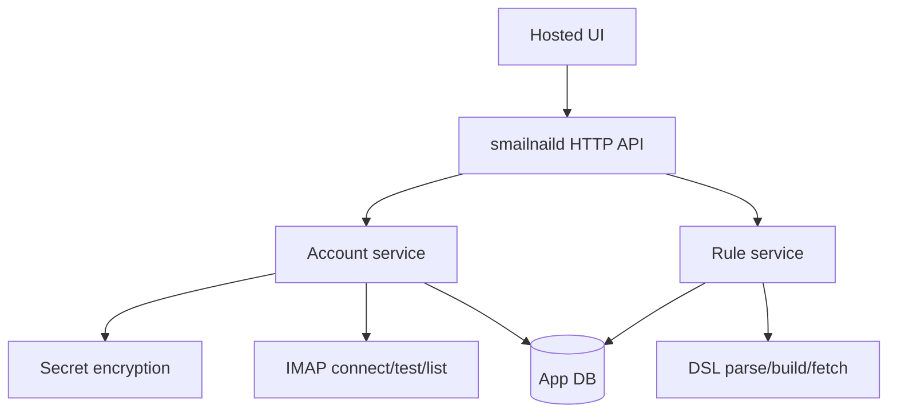

# Implementation plan for hosted smailnail account setup and rule dry-run phases

## Executive summary

This ticket takes Phase 1 and Phase 2 from the web UI research and turns them into an execution plan:

- Phase 1: hosted backend primitives for account setup
- Phase 2: rule CRUD and dry-run

The goal of these phases is simple: get the hosted product to a point where a real user can sign in, save IMAP accounts, test those accounts, browse mailbox structure, preview recent messages, create rules, and dry-run those rules safely before the MCP integration phase begins.

The implementation should happen in thin vertical slices. Each slice should add a coherent piece of behavior, keep the system runnable, and come with tests. This ticket is intentionally written as a build order, not as a generic architecture essay.

## Problem statement

The hosted `smailnaild` process exists, but it is only a skeleton. It can open a database and report health. It cannot yet:

- store account records
- encrypt IMAP credentials
- test an account connection
- list mailboxes
- preview messages
- save rules
- dry-run rules
- serve a real web UI

The UX research ticket already defined what the first useful product should do. The missing work now is concrete implementation planning so the repo can move from design to code without ambiguity.

## Scope of this ticket

In scope:

- app-side database schema for accounts, tests, rules, and rule runs
- encrypted account secret storage
- account CRUD backend
- account test backend
- mailbox list and message preview backend
- rule CRUD backend
- rule dry-run backend
- first web UI shell and screens needed to exercise those flows

Out of scope:

- MCP policy screens
- stored-account resolution inside `executeIMAPJS`
- provider OAuth integrations for Gmail or Microsoft
- threaded inbox or full webmail functionality
- collaborative or multi-organization features

## Target outcome

By the end of this ticket’s implementation, a hosted user should be able to:

1. Open `smailnaild` in a browser.
2. Create one or more IMAP account records.
3. Run a read-only account test and see structured results.
4. Browse mailboxes and preview recent messages from a saved account.
5. Create and save a rule using the existing DSL model.
6. Dry-run that rule against a selected saved account and inspect the matching messages and action plan.

## Current code baseline

The execution plan assumes the following current starting points:

- [http.go](/home/manuel/workspaces/2026-03-08/update-imap-mcp/smailnail/pkg/smailnaild/http.go) only serves `/healthz`, `/readyz`, and `/api/info`
- [db.go](/home/manuel/workspaces/2026-03-08/update-imap-mcp/smailnail/pkg/smailnaild/db.go) only bootstraps `app_metadata`
- [layer.go](/home/manuel/workspaces/2026-03-08/update-imap-mcp/smailnail/pkg/imap/layer.go) can connect and login to IMAP
- [types.go](/home/manuel/workspaces/2026-03-08/update-imap-mcp/smailnail/pkg/dsl/types.go) defines the current rule DSL
- [processor.go](/home/manuel/workspaces/2026-03-08/update-imap-mcp/smailnail/pkg/dsl/processor.go) can fetch and paginate messages
- [actions.go](/home/manuel/workspaces/2026-03-08/update-imap-mcp/smailnail/pkg/dsl/actions.go) can execute rule actions

## Design decisions

### Decision 1: keep the backend source of truth in Go

The browser UI should talk to `smailnaild` APIs. It should not reimplement rule semantics or IMAP behavior in the frontend. The frontend should submit:

- account forms
- rule forms
- dry-run requests

and receive normalized JSON responses.

### Decision 2: preserve the current DSL as the canonical rule format

The UI rule builder should generate valid current DSL YAML. That keeps the product aligned with the CLI and the MCP JavaScript surface.

### Decision 3: read-only account testing first, write probes optional

Read-only testing is what enables trust without surprise. Phase 1 should ship:

- connect
- login
- select mailbox
- list mailboxes
- fetch sample headers

Write-capability testing should be implemented as a separate API flag, not as the default behavior.

### Decision 4: use app-owned encrypted storage for account secrets

This implementation depends on the provider-neutral identity and encrypted secret design already documented in `SMAILNAIL-011`. IMAP passwords or app passwords belong in `smailnaild`’s DB, encrypted at rest, not in Keycloak.

### Decision 5: build one hosted UI shell now, not multiple disconnected tools

Even if the first frontend is small, it should be structured as the beginning of the final hosted app, not as a throwaway admin page.

## Proposed implementation shape



## Repository impact

Expected new or expanded areas in `smailnail`:

- `cmd/smailnaild/main.go`
- `cmd/smailnaild/commands/serve.go`
- `pkg/smailnaild/db.go`
- `pkg/smailnaild/http.go`
- `pkg/smailnaild/accounts/...`
- `pkg/smailnaild/rules/...`
- `pkg/smailnaild/secrets/...`
- `pkg/smailnaild/web/...`
- a frontend directory if we choose SPA embedding

## Phase 1: hosted backend primitives for account setup

### Functional deliverables

- account table and repository
- encrypted secret storage helper
- account CRUD API
- account test API
- mailbox list API
- message preview API
- UI shell with accounts list, add account form, and account test results

### Backend work

#### Schema

Add tables:

- `users` if not already introduced by another concurrent slice
- `external_identities` if needed for local user lookup
- `imap_accounts`
- `imap_account_tests`

#### Services

Add:

- `AccountRepository`
- `AccountService`
- `SecretService`

#### APIs

Add:

- `GET /api/accounts`
- `POST /api/accounts`
- `GET /api/accounts/:id`
- `PATCH /api/accounts/:id`
- `DELETE /api/accounts/:id`
- `POST /api/accounts/:id/test`
- `GET /api/accounts/:id/mailboxes`
- `GET /api/accounts/:id/messages`
- `GET /api/accounts/:id/messages/:uid`

### Frontend work

Build:

- application shell
- accounts table view
- add/edit account form
- test results screen
- mailbox explorer with message list
- message preview drawer or page

### Key backend pseudocode

```go
func (s *AccountService) CreateAccount(ctx context.Context, principal IdentityPrincipal, input CreateAccountInput) (Account, error) {
    user := users.MustFindOrCreateFromPrincipal(ctx, principal)
    encrypted := secrets.MustEncrypt(input.Password)
    return repo.InsertAccount(ctx, user.ID, input, encrypted)
}

func (s *AccountService) TestAccount(ctx context.Context, principal IdentityPrincipal, accountID string, mode TestMode) (AccountTestResult, error) {
    account := repo.MustLoadOwnedAccount(ctx, principal.UserID(), accountID)
    password := secrets.MustDecrypt(account.SecretCiphertext)
    return imaptests.Run(ctx, account, password, mode)
}
```

## Phase 2: rule CRUD and dry-run

### Functional deliverables

- rule table and repository
- rule CRUD API
- rule builder UI
- YAML preview
- dry-run API
- dry-run results screen

### Backend work

#### Schema

Add tables:

- `rules`
- `rule_runs`

#### Services

Add:

- `RuleRepository`
- `RuleService`

#### APIs

Add:

- `GET /api/rules`
- `POST /api/rules`
- `GET /api/rules/:id`
- `PATCH /api/rules/:id`
- `DELETE /api/rules/:id`
- `POST /api/rules/:id/dry-run`

### Frontend work

Build:

- rule library page
- rule builder form
- account/mailbox scope selector
- YAML preview panel
- dry-run results page

### Key backend pseudocode

```go
func (s *RuleService) SaveRule(ctx context.Context, principal IdentityPrincipal, input SaveRuleInput) (RuleRecord, error) {
    user := users.MustFindOrCreateFromPrincipal(ctx, principal)
    parsed := dsl.MustParseRuleString(input.RuleYAML)
    parsed.Validate()
    return repo.UpsertRule(ctx, user.ID, input.ScopeAccountID, input.Name, input.RuleYAML)
}

func (s *RuleService) DryRunRule(ctx context.Context, principal IdentityPrincipal, ruleID string, input DryRunInput) (DryRunResult, error) {
    rule := repo.MustLoadOwnedRule(ctx, principal.UserID(), ruleID)
    account := accounts.MustLoadOwnedAccount(ctx, principal.UserID(), input.AccountID)
    client := accounts.MustOpenClient(ctx, account)
    parsed := dsl.MustParseRuleString(rule.RuleYAML)
    messages := parsed.FetchMessages(client)
    return summarizeDryRun(parsed, messages), nil
}
```

## Granular task breakdown

The tasks below are ordered to support small, reviewable commits.

## Milestone A: foundation and schema

1. Add a stable package layout under `pkg/smailnaild/` for `accounts`, `rules`, and `secrets`.
2. Introduce a migration/bootstrap strategy instead of a single `app_metadata` initializer in [db.go](/home/manuel/workspaces/2026-03-08/update-imap-mcp/smailnail/pkg/smailnaild/db.go).
3. Add `imap_accounts` and `imap_account_tests` schema.
4. Add `rules` and `rule_runs` schema.
5. Add test coverage for SQLite bootstrap.
6. Verify the schema remains portable to Postgres through Clay SQL configuration.

## Milestone B: secret handling

7. Add a `secrets` package for encryption and decryption helpers.
8. Define environment/config loading for the encryption key.
9. Add tests for encrypt/decrypt round trips and corrupt-ciphertext failure.
10. Ensure logs and API responses never leak plaintext secrets.

## Milestone C: account repository and service

11. Implement `AccountRepository` with create, get, list, update, delete, and latest-test retrieval.
12. Implement `AccountService.CreateAccount`.
13. Implement `AccountService.UpdateAccount`.
14. Implement `AccountService.DeleteAccount` with safe behavior for referenced rules.
15. Add ownership checks keyed by the authenticated application user.
16. Add repository and service tests with SQLite.

## Milestone D: account testing and mailbox preview

17. Implement a read-only account test runner around [layer.go](/home/manuel/workspaces/2026-03-08/update-imap-mcp/smailnail/pkg/imap/layer.go).
18. Normalize IMAP failures into UI-safe error codes and warning codes.
19. Implement mailbox listing.
20. Implement recent message preview using [processor.go](/home/manuel/workspaces/2026-03-08/update-imap-mcp/smailnail/pkg/dsl/processor.go).
21. Implement message detail preview with limited MIME content.
22. Add integration tests against the Dovecot fixture for test/list/preview flows.

## Milestone E: HTTP API for Phase 1

23. Introduce a router split in [http.go](/home/manuel/workspaces/2026-03-08/update-imap-mcp/smailnail/pkg/smailnaild/http.go) so health endpoints and application APIs are not mixed in anonymous inline handlers.
24. Add JSON handlers for account CRUD.
25. Add JSON handler for account testing.
26. Add JSON handlers for mailbox list and message previews.
27. Add request/response DTOs and error helpers.
28. Add HTTP tests for happy paths and error cases.

## Milestone F: frontend shell and account screens

29. Add the hosted frontend scaffold and embed/build plumbing.
30. Implement application shell, navigation, and session-aware bootstrapping.
31. Implement accounts list screen.
32. Implement add/edit account form with provider hints.
33. Implement account test results screen.
34. Implement mailbox explorer and message preview.
35. Add frontend tests for account flows.

## Milestone G: rule repository and service

36. Implement `RuleRepository`.
37. Implement `RuleService.SaveRule`.
38. Implement `RuleService.ListRules`.
39. Implement `RuleService.DeleteRule`.
40. Add rule YAML validation against the current DSL in [types.go](/home/manuel/workspaces/2026-03-08/update-imap-mcp/smailnail/pkg/dsl/types.go).
41. Add repository and service tests.

## Milestone H: dry-run execution

42. Implement `DryRunRule` using stored accounts plus [processor.go](/home/manuel/workspaces/2026-03-08/update-imap-mcp/smailnail/pkg/dsl/processor.go).
43. Add dry-run summaries that include sample rows and action-plan summaries.
44. Persist dry-run runs in `rule_runs`.
45. Add integration tests for dry-run behavior against the Dovecot fixture.

## Milestone I: rule UI

46. Implement rule library page.
47. Implement rule builder form for account scope, search fields, output fields, and actions.
48. Implement YAML preview panel.
49. Implement dry-run results page.
50. Add frontend tests for rule create/edit/dry-run flows.

## Milestone J: end-to-end completion

51. Add an end-to-end smoke covering account creation, account test, mailbox preview, rule save, and rule dry-run.
52. Update README and hosted usage docs for local testing.
53. Add an operator playbook for setting up the local Dovecot stack and running these flows.

## Suggested commit slicing

Recommended commit boundaries:

1. `feat(smailnaild): add account and rule schema bootstrap`
2. `feat(smailnaild): add encrypted account secret storage`
3. `feat(smailnaild): add account repository and service`
4. `feat(smailnaild): add account test and mailbox preview apis`
5. `feat(smailnaild): scaffold hosted frontend shell`
6. `feat(smailnaild): add account management screens`
7. `feat(smailnaild): add rule repository and validation`
8. `feat(smailnaild): add rule dry-run api and ui`
9. `docs(smailnail): document hosted account setup flow`

## Risks and mitigation

### Risk: too much frontend before stable APIs

Mitigation:

- define DTOs early
- land backend APIs before polishing UI behavior

### Risk: provider-specific auth failures become product confusion

Mitigation:

- classify errors
- show provider hints in the account form and test results

### Risk: destructive rule actions leak into dry-run accidentally

Mitigation:

- keep dry-run execution path separate from live execute path
- add explicit tests that dry-run never calls the action executor in [actions.go](/home/manuel/workspaces/2026-03-08/update-imap-mcp/smailnail/pkg/dsl/actions.go)

### Risk: long-running implementation without usable checkpoints

Mitigation:

- commit by vertical slice
- keep the app runnable after each milestone

## Open questions

- Should Phase 1 ship a minimal login/session implementation first, or should that be tracked in a sibling ticket if not already underway?
- Should the first frontend be server-rendered for speed, or should we commit immediately to an embedded SPA?
- Should rule ownership be single-account only in Phase 2, even if the schema later allows multi-account rules?

