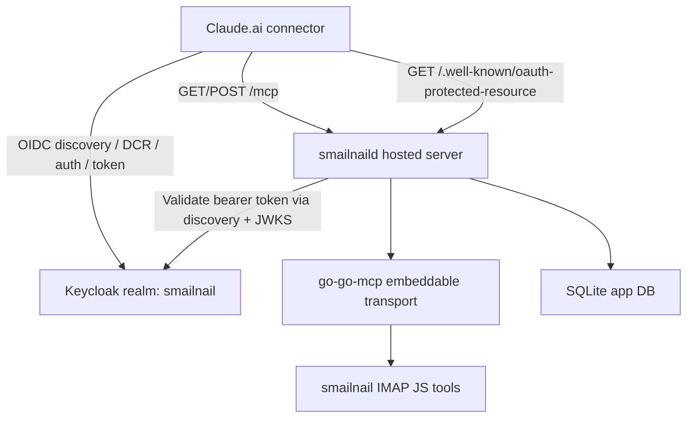
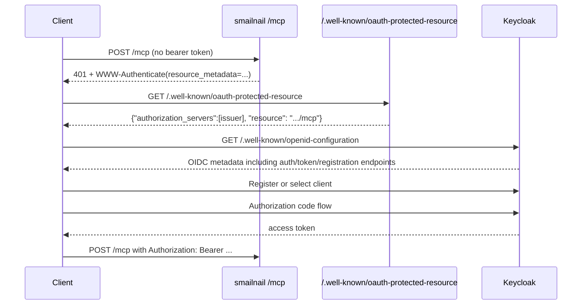

# Claude MCP OAuth and Keycloak dynamic client registration guide for smailnail

## Executive Summary

This document explains a production issue in the hosted `smailnail` MCP deployment: OpenAI clients can use the server, but Claude.ai fails during login before it ever reaches a successful bearer-authenticated MCP call. The important finding is that the smailnail server is now behaving correctly. It returns a standards-shaped `401` challenge, publishes protected resource metadata at `/.well-known/oauth-protected-resource`, and validates external OIDC bearer tokens using the configured Keycloak realm. The remaining failure occurs inside Keycloak during Claude's dynamic client registration (DCR) attempt.

The decisive evidence came from live Keycloak logs on `2026-03-18`: requests from Claude's IP `160.79.106.11` triggered `CLIENT_REGISTER_ERROR` events with `error="not_allowed"` and the message that requested scope `service_account` is not trusted. The smailnail server logs for the same time window show anonymous `POST /mcp` and `GET /mcp` requests, successful fetches of the protected resource metadata endpoint, and no follow-up request with a bearer token. Taken together, these logs show that Claude reaches Keycloak, attempts DCR, Keycloak rejects the registration request, and Claude therefore never completes the authorization code flow.

The immediate engineering conclusion is that the current production problem is not in the smailnail MCP transport anymore. It is in the Keycloak realm's client registration policy. The design question is whether to loosen anonymous DCR so Claude can self-register, or to avoid DCR entirely by provisioning a dedicated client for Claude and configuring the connector to use it.

## Problem Statement

The hosted smailnail deployment exposes MCP on `https://smailnail.mcp.scapegoat.dev/mcp` and protects it with external OIDC. This deployment is intended to support remote MCP clients that can perform OAuth 2.0 and OpenID Connect flows against `https://auth.scapegoat.dev/realms/smailnail`. In practice:

1. OpenAI-based clients work against the server.
2. Claude.ai discovers the protected resource metadata correctly.
3. Claude.ai never completes a successful login to the MCP server.
4. Users see repeated anonymous `401` responses from `/mcp`.

The task is not only to fix the current issue. It is also to write down the architecture in enough detail that a new intern can understand:

- what MCP is,
- how OAuth/OIDC are used in this deployment,
- how smailnail, go-go-mcp, Coolify, and Keycloak fit together,
- what `kcadm.sh` is and why it matters,
- why Claude currently fails,
- what implementation choices exist to remediate the failure.

## Scope

This document covers:

- the hosted `smailnaild` + MCP runtime architecture,
- the relevant `go-go-mcp` auth machinery,
- the Keycloak realm and DCR policies involved in Claude login,
- the live evidence collected during debugging,
- design options and an implementation guide.

This document does not cover:

- a full OAuth 2.0 tutorial for unrelated systems,
- browser session login behavior for the web UI beyond the boundaries needed to explain separation from MCP auth,
- a finished code change for Keycloak policy automation.

## Terms and Concepts

This section is intentionally slow and explicit. A new intern should be able to read it without already knowing OAuth or Keycloak.

### Model Context Protocol (MCP)

MCP is a protocol for connecting an AI client to tools and resources exposed by a server. In this project, the server exposes tools such as `executeIMAPJS` and `getIMAPJSDocumentation` through HTTP. The hosted server uses streamable HTTP transport rather than stdio.

In concrete terms, the client sends requests to `/mcp`, and the server returns tool metadata, tool results, or authorization errors.

### OAuth 2.0 and OpenID Connect (OIDC)

OAuth 2.0 is the authorization framework that lets a client obtain an access token from an authorization server. OpenID Connect is an identity layer on top of OAuth 2.0 that standardizes discovery documents, user identity claims, and ID tokens.

In this deployment:

- Keycloak is the authorization server and OIDC provider.
- smailnail is the protected resource server.
- Claude is the OAuth client.

### Protected Resource Metadata

Protected resource metadata is the JSON document the MCP server serves at `/.well-known/oauth-protected-resource`. Its job is to tell a client:

- what resource URL it is trying to access,
- which authorization server(s) protect that resource.

In this deployment the response currently looks like:

```json
{
  "authorization_servers": [
    "https://auth.scapegoat.dev/realms/smailnail"
  ],
  "resource": "https://smailnail.mcp.scapegoat.dev/mcp"
}
```

### WWW-Authenticate Bearer Challenge

When the client calls `/mcp` without a bearer token, the server returns `401 Unauthorized` with a `WWW-Authenticate` header. That header advertises where the client can discover the protected resource metadata. The current live header is:

```text
Bearer realm="mcp", resource_metadata="https://smailnail.mcp.scapegoat.dev/.well-known/oauth-protected-resource"
```

This was simplified during this debugging session to remove extra fields and make the challenge as conservative and standards-shaped as possible.

### Dynamic Client Registration (DCR)

Dynamic client registration is the process where an OAuth client asks the authorization server to create a client entry on the fly instead of using a manually pre-created client. Keycloak exposes a registration endpoint, and the realm's OIDC discovery document advertises it.

Claude appears to use DCR in this environment. That means Claude is not simply using the manually created `smailnail-mcp` client. It is asking Keycloak to register a new client dynamically. Keycloak is rejecting that request.

### Keycloak Realm

A realm in Keycloak is an isolated namespace containing:

- users,
- clients,
- scopes,
- tokens,
- policies,
- event logs.

This deployment uses the realm `smailnail`.

### `kcadm.sh`

`kcadm.sh` is Keycloak's administrative command-line interface. It is a thin CLI wrapper around Keycloak's admin REST API. You use it to:

- log in as an admin,
- inspect realms, clients, and components,
- create or update Keycloak configuration from scripts.

In this project, `kcadm.sh` is useful because the Keycloak instance lives on the Coolify host inside a container. `kcadm.sh` lets us inspect the real production policies instead of guessing from the UI.

## Current System Architecture

### Deployment shape

The merged hosted deployment is described in [smailnaild-merged-coolify.md](/home/manuel/workspaces/2026-03-08/update-imap-mcp/smailnail/docs/deployments/smailnaild-merged-coolify.md#L1). That document states that one `smailnaild` process serves the web UI, web OIDC routes, MCP metadata, and MCP transport on the same HTTP listener.

The important runtime routes are documented there at [smailnaild-merged-coolify.md](/home/manuel/workspaces/2026-03-08/update-imap-mcp/smailnail/docs/deployments/smailnaild-merged-coolify.md#L22):

- `/auth/*` for browser login,
- `/api/*` for the hosted web API,
- `/.well-known/oauth-protected-resource` for MCP metadata,
- `/mcp` for the bearer-token-protected MCP transport,
- `/readyz` for readiness checks.

### High-level component diagram



### Where smailnail mounts MCP

The hosted server command creates an `mcpMux` when MCP is enabled and mounts it into the main hosted server in [serve.go](/home/manuel/workspaces/2026-03-08/update-imap-mcp/smailnail/cmd/smailnaild/commands/serve.go#L157). The important part is:

```go
if mcpSettings.Enabled {
    mcpMux := http.NewServeMux()
    mcpAuthOptions := mcpSettings.AuthOptions(authSettings.OIDCIssuerURL)
    if err := imapjs.MountHTTPHandlers(mcpMux, imapjs.MountedOptions{ ... }); err != nil {
        return err
    }
    mcpHandler = mcpMux
}
```

That `mcpHandler` is then passed into `hostedapp.NewHTTPServer(...)` and attached to the hosted mux.

The actual route mounting happens in [http.go](/home/manuel/workspaces/2026-03-08/update-imap-mcp/smailnail/pkg/smailnaild/http.go#L132), where the hosted app registers:

- `/.well-known/oauth-protected-resource`
- `/mcp`
- `/mcp/`

against the MCP handler.

### Where MCP auth settings come from

[hosted_config.go](/home/manuel/workspaces/2026-03-08/update-imap-mcp/smailnail/pkg/mcp/imapjs/hosted_config.go#L15) defines the hosted MCP auth settings:

- `mcp-auth-mode`
- `mcp-auth-resource-url`
- `mcp-oidc-issuer-url`
- `mcp-oidc-discovery-url`
- `mcp-oidc-audience`
- `mcp-oidc-required-scopes`

The `AuthOptions(...)` method at [hosted_config.go](/home/manuel/workspaces/2026-03-08/update-imap-mcp/smailnail/pkg/mcp/imapjs/hosted_config.go#L100) converts those settings into `go-go-mcp` auth configuration. This is the bridge between deployment environment variables and the embeddable auth layer.

### Where go-go-mcp enforces bearer auth

The `go-go-mcp` embeddable backend mounts `/mcp` and `/.well-known/oauth-protected-resource` in [mcpgo_backend.go](/home/manuel/workspaces/2026-03-08/update-imap-mcp/go-go-mcp/pkg/embeddable/mcpgo_backend.go#L308). The auth middleware in [mcpgo_backend.go](/home/manuel/workspaces/2026-03-08/update-imap-mcp/go-go-mcp/pkg/embeddable/mcpgo_backend.go#L329) does the following:

1. Checks for `Authorization: Bearer ...`.
2. If missing, sets `WWW-Authenticate` and returns `401`.
3. If present, validates the bearer token.
4. If valid, injects `X-MCP-Subject` and `X-MCP-Client-ID`.

The protected resource metadata endpoint is served by `protectedResourceHandler(...)` at [mcpgo_backend.go](/home/manuel/workspaces/2026-03-08/update-imap-mcp/go-go-mcp/pkg/embeddable/mcpgo_backend.go#L356).

### Where the bearer challenge comes from

The minimal bearer challenge is built in [auth_provider.go](/home/manuel/workspaces/2026-03-08/update-imap-mcp/go-go-mcp/pkg/embeddable/auth_provider.go#L111). The helper now returns only:

```go
Bearer realm="mcp", resource_metadata="https://.../.well-known/oauth-protected-resource"
```

For external OIDC mode, the provider returns protected resource metadata and validates JWTs in [auth_provider_external.go](/home/manuel/workspaces/2026-03-08/update-imap-mcp/go-go-mcp/pkg/embeddable/auth_provider_external.go#L60).

## Runtime Flow Walkthrough

### Normal unauthenticated MCP discovery flow

This is what a well-behaved client should do when it first touches the server without a token.



### Live smailnail evidence

The live smailnail logs on `2026-03-18` show the first half of the flow working correctly:

```text
DBG http request ... method=POST path=/mcp ... ua=python-httpx/0.28.1
DBG set WWW-Authenticate header="Bearer realm=\"mcp\", resource_metadata=\"https://smailnail.mcp.scapegoat.dev/.well-known/oauth-protected-resource\""
WRN Unauthorized: missing bearer header ...
INF served protected resource metadata endpoint=/.well-known/oauth-protected-resource ...
```

This evidence proves:

- the challenge is present,
- the protected resource metadata endpoint is reachable,
- the advertised `resource` URL is exact,
- the server is not rejecting a valid token because no token is ever presented.

## Keycloak Discovery and Registration Surface

The realm's live OIDC discovery document advertises:

```json
{
  "issuer": "https://auth.scapegoat.dev/realms/smailnail",
  "authorization_endpoint": "https://auth.scapegoat.dev/realms/smailnail/protocol/openid-connect/auth",
  "token_endpoint": "https://auth.scapegoat.dev/realms/smailnail/protocol/openid-connect/token",
  "jwks_uri": "https://auth.scapegoat.dev/realms/smailnail/protocol/openid-connect/certs",
  "registration_endpoint": "https://auth.scapegoat.dev/realms/smailnail/clients-registrations/openid-connect"
}
```

That means any DCR-capable client can discover the registration endpoint automatically from the issuer metadata. The same discovery document also advertises `service_account` in `scopes_supported`.

This is important because it creates an easy misunderstanding:

- from the discovery document, the realm appears to support `service_account`,
- but the anonymous client registration policy does not trust that scope.

## Root Cause Analysis

### What Claude is doing

The smailnail logs show Claude and `python-httpx/0.28.1` probing `/mcp` and reading `/.well-known/oauth-protected-resource`. The Keycloak logs show that, shortly after those requests, the same source IP performs dynamic client registration attempts.

The matching Keycloak log lines are:

```text
2026-03-18 20:41:19 WARN type="CLIENT_REGISTER_ERROR" ... ipAddress="160.79.106.11" error="not_allowed"
2026-03-18 20:41:19 WARN Requested scope 'service_account' not trusted ...
2026-03-18 20:41:49 WARN type="CLIENT_REGISTER_ERROR" ... ipAddress="160.79.106.11" error="not_allowed"
```

This is strong evidence that Claude is not failing before discovery. It is reaching the Keycloak registration endpoint and being denied there.

### What Keycloak is configured to allow

Using `kcadm.sh`, we inspected the realm's client registration policy components. The relevant anonymous policy is:

```json
{
  "name": "Allowed Client Scopes",
  "providerId": "allowed-client-templates",
  "subType": "anonymous",
  "config": {
    "allow-default-scopes": ["true"],
    "allowed-client-scopes": ["mcp:tools", "openid", "web-origins"]
  }
}
```

That policy does not include `service_account`.

Therefore the failure is:

1. Claude tries anonymous DCR.
2. Claude requests `service_account` as part of the client representation or requested scopes.
3. Keycloak's anonymous DCR policy rejects the request.
4. Claude never gets a registered client.
5. Claude never reaches `/authorize` or `/token`.
6. smailnail keeps seeing anonymous `/mcp` retries.

### Why the manually created `smailnail-mcp` client does not save us

There is already a manually created Keycloak client named `smailnail-mcp`, with:

- `publicClient: true`
- `standardFlowEnabled: true`
- redirect URIs for `https://claude.ai/api/mcp/auth_callback`
- redirect URIs for `https://claude.com/api/mcp/auth_callback`

But Claude is still attempting DCR instead of simply using that existing client. That means one of two things is true:

1. Claude does not know to reuse that client automatically.
2. Claude can reuse a pre-provisioned client only if the connector configuration explicitly supplies a client ID and possibly a secret.

The server logs strongly suggest Claude is on the DCR path today.

## Why the MCP server changes were still necessary

During this debugging session we made two server-side improvements:

1. We stopped logging `/readyz` at hosted debug level in [http.go](/home/manuel/workspaces/2026-03-08/update-imap-mcp/smailnail/pkg/smailnaild/http.go#L557), which removed Coolify readiness noise from production logs.
2. We simplified the `WWW-Authenticate` challenge in [auth_provider.go](/home/manuel/workspaces/2026-03-08/update-imap-mcp/go-go-mcp/pkg/embeddable/auth_provider.go#L111) and [auth_provider_external.go](/home/manuel/workspaces/2026-03-08/update-imap-mcp/go-go-mcp/pkg/embeddable/auth_provider_external.go#L176).

These changes were important because they removed an avoidable compatibility risk. They did not fix Claude's login by themselves, but they ruled out a server-side challenge-shape problem.

## Design Options

### Option A: Loosen anonymous DCR policy to allow `service_account`

This option changes Keycloak so Claude's DCR request is accepted.

Conceptually:

```text
Current anonymous allowed scopes: mcp:tools, openid, web-origins
Proposed anonymous allowed scopes: mcp:tools, openid, web-origins, service_account
```

Benefits:

- preserves the DCR flow Claude is already attempting,
- likely requires no Claude-side connector reconfiguration,
- keeps the smailnail server unchanged.

Risks:

- anonymous DCR becomes more permissive,
- any public client registration caller may request broader capabilities,
- `service_account` has security implications and should not be enabled casually.

Operational note:

Because the policy subtype is `anonymous`, this is a public-facing decision. It is not limited to one pre-trusted client.

### Option B: Keep anonymous DCR strict and use a pre-provisioned client

This option avoids changing anonymous DCR policy and instead configures Claude to use a known client, such as `smailnail-mcp`.

Benefits:

- safer than broadening anonymous registration,
- keeps realm registration policy tighter,
- simpler to audit because the client is explicit and pre-created.

Risks:

- depends on Claude connector settings supporting manual client ID or credentials,
- may require connector-specific operator knowledge,
- may not work if Claude insists on DCR in this mode.

### Option C: Use authenticated DCR rather than anonymous DCR

Keycloak supports multiple registration modes. In theory, one can issue an initial access token or otherwise authenticate DCR so registration policies can differ from the anonymous path.

Benefits:

- allows DCR while reducing public exposure,
- finer control over who may register clients.

Risks:

- more moving parts,
- connector may not support this specific registration mode cleanly,
- more operator burden.

### Recommended direction

For an intern-safe and operations-safe path, the recommendation is:

1. First determine whether Claude can be configured with a pre-provisioned client.
2. If yes, prefer Option B.
3. If no, evaluate Option A carefully and restrict policy changes as narrowly as Keycloak allows.

This recommendation favors least privilege. Anonymous DCR policy changes should be made only if the connector cannot use a fixed client.

## Detailed Implementation Guide

### Phase 1: Capture the current state

Before changing anything, record the current production behavior.

Commands:

```bash
curl -i -H 'Content-Type: application/json' \
  -d '{"jsonrpc":"2.0","id":"1","method":"tools/list","params":{}}' \
  https://smailnail.mcp.scapegoat.dev/mcp

curl -fsS https://smailnail.mcp.scapegoat.dev/.well-known/oauth-protected-resource | jq

curl -fsS https://auth.scapegoat.dev/realms/smailnail/.well-known/openid-configuration | jq
```

Expected:

- `/mcp` returns `401` with `resource_metadata=...`
- protected resource metadata points at the exact public `/mcp` URL
- OIDC discovery includes a `registration_endpoint`

### Phase 2: Inspect Keycloak event logs

Use container logs to check for DCR failures from the same client IP and time window.

Commands:

```bash
ssh root@89.167.52.236 \
  'docker logs --since 20m keycloak-k12lm4blpo13louovn3pfsgs 2>&1 | tail -n 200'

ssh root@89.167.52.236 \
  'docker logs --since 20m keycloak-k12lm4blpo13louovn3pfsgs 2>&1 \
    | grep -E "CLIENT_REGISTER_ERROR|service_account|160\.79\.106\.11"'
```

Interpretation:

- `CLIENT_REGISTER_ERROR` means the client reached the registration endpoint
- `Requested scope 'service_account' not trusted` means policy, not networking, is blocking the flow

### Phase 3: Inspect registration policy with `kcadm.sh`

This is where `kcadm.sh` matters. Run it inside the Keycloak container so it can use the container's own bootstrap admin credentials.

```bash
ssh root@89.167.52.236 \
  "docker exec keycloak-k12lm4blpo13louovn3pfsgs bash -lc \
  '/opt/keycloak/bin/kcadm.sh config credentials \
     --server http://127.0.0.1:8080 \
     --realm master \
     --user \"\$KC_BOOTSTRAP_ADMIN_USERNAME\" \
     --password \"\$KC_BOOTSTRAP_ADMIN_PASSWORD\" >/tmp/kcadm-login.out && \
   /opt/keycloak/bin/kcadm.sh get components -r smailnail' | jq '.[] | select(.providerId==\"allowed-client-templates\")'"
```

The current production evidence shows:

```json
{
  "name": "Allowed Client Scopes",
  "subType": "anonymous",
  "config": {
    "allow-default-scopes": ["true"],
    "allowed-client-scopes": ["mcp:tools", "openid", "web-origins"]
  }
}
```

### Phase 4A: If choosing Option A, adjust anonymous DCR policy

Pseudo-implementation:

```text
read anonymous allowed-client-scopes
append service_account if policy owners approve
update policy
retry Claude login
observe whether logs now show /authorize or /token traffic instead of CLIENT_REGISTER_ERROR
```

Operational warning:

- make one policy change at a time,
- record the old value,
- verify whether the change affects all anonymous DCR callers.

### Phase 4B: If choosing Option B, use a pre-created client

Checklist:

1. Confirm `smailnail-mcp` exists and is enabled.
2. Confirm redirect URIs include:
   - `https://claude.ai/api/mcp/auth_callback`
   - `https://claude.com/api/mcp/auth_callback`
3. Check whether Claude connector settings support a client ID or client secret override.
4. If supported, configure the connector to use `smailnail-mcp`.
5. Retry login and inspect logs.

Success criteria:

- no `CLIENT_REGISTER_ERROR`,
- Keycloak logs show `/authorize` and `/token`,
- smailnail logs show a request with `has_authz=true`.

## Pseudocode for the end-to-end decision logic

```text
function diagnoseClaudeMCPLogin():
    if smailnail /mcp challenge is malformed:
        fix server challenge
        redeploy
        return

    if protected resource metadata is missing or wrong:
        fix advertised resource URL / issuer
        redeploy
        return

    auth_logs = inspect_keycloak_logs()

    if auth_logs contain CLIENT_REGISTER_ERROR:
        inspect DCR policies
        if organization prefers tight public policy:
            try pre-provisioned client path
        else:
            carefully relax DCR scope policy
        return

    if auth_logs show authorize/token but smailnail never sees bearer token:
        inspect callback, redirect, and client config
        return

    if smailnail sees bearer token but rejects it:
        inspect audience, issuer, scopes, and JWKS validation
        return
```

## API Reference

### smailnail endpoints

| Endpoint | Method | Purpose | Auth |
| --- | --- | --- | --- |
| `/readyz` | `GET` | Readiness check | none |
| `/.well-known/oauth-protected-resource` | `GET` | Protected resource metadata for MCP | none |
| `/mcp` | `GET` / `POST` | MCP transport endpoint | bearer token |

### Keycloak OIDC endpoints

| Endpoint | Purpose |
| --- | --- |
| `/realms/smailnail/.well-known/openid-configuration` | OIDC discovery metadata |
| `/realms/smailnail/protocol/openid-connect/auth` | authorization endpoint |
| `/realms/smailnail/protocol/openid-connect/token` | token endpoint |
| `/realms/smailnail/protocol/openid-connect/certs` | JWKS endpoint |
| `/realms/smailnail/clients-registrations/openid-connect` | dynamic client registration endpoint |

## Operational Notes for New Interns

### Where to look first when OAuth is broken

Always split the system into three boundaries:

1. smailnail as the protected resource server,
2. Keycloak as the authorization server,
3. Claude as the OAuth client.

If you only look at smailnail logs, you can miss failures happening inside Keycloak. That is exactly what happened here: the smailnail logs made it look like Claude simply stopped after protected resource metadata, but the Keycloak logs proved that Claude actually did continue to the registration endpoint and failed there.

### Why log correlation matters

Use:

- timestamps,
- source IP,
- user agent,
- request path,
- request sequence.

In this incident, the same IP `160.79.106.11` appeared in both the smailnail logs and the Keycloak `CLIENT_REGISTER_ERROR` events. That correlation is what converted a hypothesis into a strong root-cause statement.

## Alternatives Considered

The team already tested one important alternative during this incident: changing the `WWW-Authenticate` challenge shape. That was worth doing because it removed a compatibility question, but it did not resolve Claude login. This alternative is therefore documented as a completed elimination step rather than the root cause.

Another alternative would be to disable auth temporarily and confirm raw MCP transport compatibility. That would answer a different question, but it would not validate the OAuth behavior we actually need in production, so it was not the recommended next step.

## Implementation Plan

### Phase 1

- Keep the current server-side challenge shape and `/readyz` logging changes.
- Preserve the exact production logs that show `CLIENT_REGISTER_ERROR`.
- Record the current anonymous DCR policy configuration.

### Phase 2

- Decide whether the preferred fix is anonymous DCR policy relaxation or pre-provisioned client reuse.
- Document the security review for that choice.

### Phase 3

- Apply the Keycloak change in a controlled way.
- Retry Claude login.
- Capture both smailnail and Keycloak logs for the new run.

### Phase 4

- If Claude reaches `/authorize`, continue validating token issuance.
- If Claude reaches `/token`, validate the returned access token against smailnail audience/scope requirements.
- If Claude still fails, compare the new failure mode against the previous one and update this ticket.

## Open Questions

1. Can Claude's connector be configured to use the pre-created `smailnail-mcp` client directly?
2. If anonymous DCR is required, is allowing `service_account` acceptable under the team's security policy?
3. Is Claude requesting `service_account` as a scope, a default client scope, or another field in the client representation? The logs show the rejected scope but not the full request payload.
4. Should the long-term public endpoint move from `smailnail.mcp.scapegoat.dev` to the merged host at `smailnail.scapegoat.dev/mcp` after the auth path is stable?

## References

- Hosted MCP mounting and route integration:
  - [serve.go](/home/manuel/workspaces/2026-03-08/update-imap-mcp/smailnail/cmd/smailnaild/commands/serve.go#L157)
  - [http.go](/home/manuel/workspaces/2026-03-08/update-imap-mcp/smailnail/pkg/smailnaild/http.go#L132)
- Hosted MCP configuration:
  - [hosted_config.go](/home/manuel/workspaces/2026-03-08/update-imap-mcp/smailnail/pkg/mcp/imapjs/hosted_config.go#L15)
  - [server.go](/home/manuel/workspaces/2026-03-08/update-imap-mcp/smailnail/pkg/mcp/imapjs/server.go#L33)
- Embeddable auth implementation:
  - [auth_provider.go](/home/manuel/workspaces/2026-03-08/update-imap-mcp/go-go-mcp/pkg/embeddable/auth_provider.go#L27)
  - [auth_provider_external.go](/home/manuel/workspaces/2026-03-08/update-imap-mcp/go-go-mcp/pkg/embeddable/auth_provider_external.go#L60)
  - [mcpgo_backend.go](/home/manuel/workspaces/2026-03-08/update-imap-mcp/go-go-mcp/pkg/embeddable/mcpgo_backend.go#L308)
- Deployment and operations docs:
  - [smailnaild-merged-coolify.md](/home/manuel/workspaces/2026-03-08/update-imap-mcp/smailnail/docs/deployments/smailnaild-merged-coolify.md#L1)
  - [02-recreate-and-verify-hosted-smailnail-mcp.md](/home/manuel/workspaces/2026-03-08/update-imap-mcp/go-go-mcp/ttmp/2026/03/16/SMAILNAIL-010-MCP-COOLIFY-DEPLOYMENT--deploy-smailnail-mcp-to-coolify-with-keycloak-external-oidc/reference/02-recreate-and-verify-hosted-smailnail-mcp.md)

## Problem Statement

<!-- Describe the problem this design addresses -->

## Proposed Solution

<!-- Describe the proposed solution in detail -->

## Design Decisions

<!-- Document key design decisions and rationale -->

## Alternatives Considered

<!-- List alternative approaches that were considered and why they were rejected -->

## Implementation Plan

<!-- Outline the steps to implement this design -->

## Open Questions

<!-- List any unresolved questions or concerns -->

## References

<!-- Link to related documents, RFCs, or external resources -->
